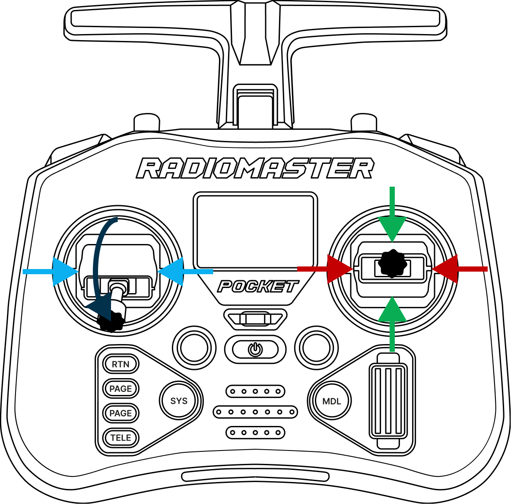
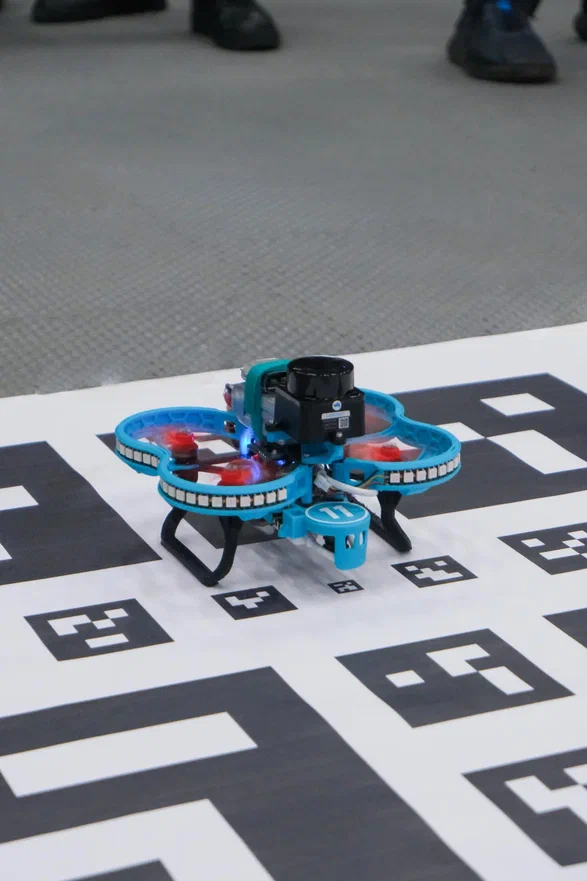
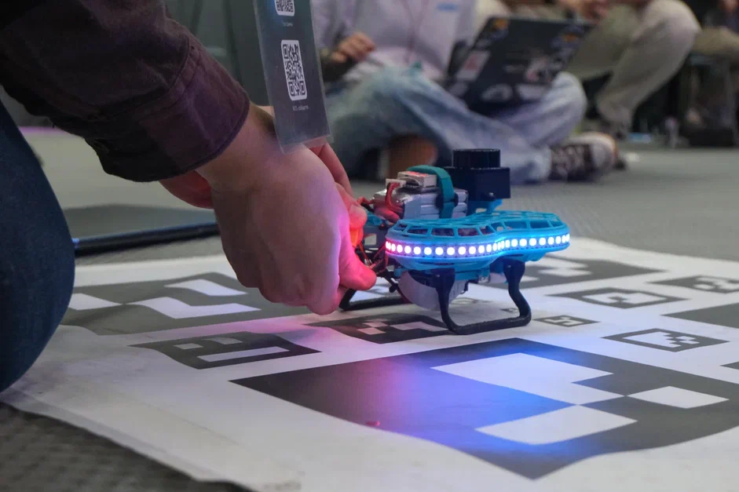

# Автоматическая проверка

* Разместите карту ArUco-меток в центре полётной зоны
* Включите аппаратуру управления
* Перевести левый стик вниз стики управления , а правый в центральное положение

  

* Установите Обрик на точку взлета

  

* Подключите АКБ к Обрику

  

* Дождитесь полного включения Обрика

> **Note** Обрик полностью включен, если Wi-Fi сеть появилась для подключения.

* Отойдите от Обрика
* Подключитесь к [Обрику по Wi-Fi](connect_wi-fi.md)
* Откройте веб-интерфейсs
* Запустите онлайн терминал/VS Code
* Запустите в терминале автоматическую проверку корректности настроек и работы всех подсистем Обрика

    ```bash
    ros2 run self_check selfcheck.py
    ```

**Описание некоторых проверок:**

- **FCU (PX4 DDS)**: наличие связи с PX4 (`VehicleStatus`) и базовые статусы (`TimesyncStatus`, `FailsafeFlags`), а также расширенная проверка **батареи** по `BatteryStatus`.
- **TelemetryStatus (PX4 DDS)**: вывод полей телеметрии из `TelemetryStatus` (если доступны в вашей версии `px4_msgs`).
- **VehicleControlMode / flight mode (PX4 DDS)**: вывод **полетного режима** (по `VehicleStatus.nav_state`).
- **PX4 Local Position (PX4 DDS)**: вывод локальной позиции PX4 (`VehicleLocalPosition`) одной строкой: позиция/скорости/heading/флаги валидности.
- **IMU (PX4 DDS)**: обновление `SensorCombined`.
- **Attitude (PX4 DDS)**: обновление `VehicleAttitude`, вывод углов и предупреждение при сильном наклоне.
- **Local position (ArUco)**: обновление `PoseWithCovarianceStamped` из `--pose-topic`.
- **Velocity estimation (from ArUco pose)**: оценка максимальных скоростей по окну измерений.
- **Camera**: обновление `sensor_msgs/Image`.
- **ArUco markers**: обновление массива маркеров (`--markers-topic`, тип через `--markers-pytype`).
- **VPE (vision input vs PX4 estimate)**: сравнение входной одометрии (`--visual-odom-topic`) и PX4 odometry (`--vehicle-odometry-topic`).
- **SBC health**: свободное место на диске + (на Raspberry Pi) `vcgencmd get_throttled`. В Docker без `/dev/vchiq` проверка троттлинга будет пропущена.
- **CPU usage**: загрузка CPU по `/proc/stat`.

> **Caution** Убедитесь, что основные пункты отмечены как успешные (зелёные/«OK»):

* **ArUco** — маркеры распознаются
* **Local position** — позиция вычислена
* **FCU** — связь с полётным контроллером есть
* **Velocity estimation** — скорость определена.

> **Caution** Если проверка selfcheck.py показывает ошибки (красный цвет) - взлёт запрещён.
>
> Исправьте ошибки  или обратитесь в [техподдержку](https://t.me/sverk_support).
