# Калибровка датчиков

Во вкладке **Sensors** находятся пункты калибровки датчиков Обрика

> **Hint** От точности калибровки датчиков зависит качество полета.

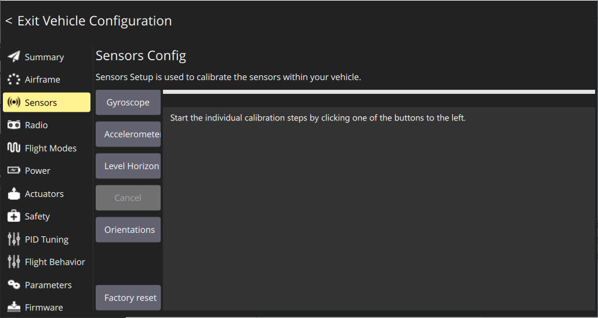

## Шаг 1:  Калибровка Гироскопа

* Выберите меню **Gyroscope**

    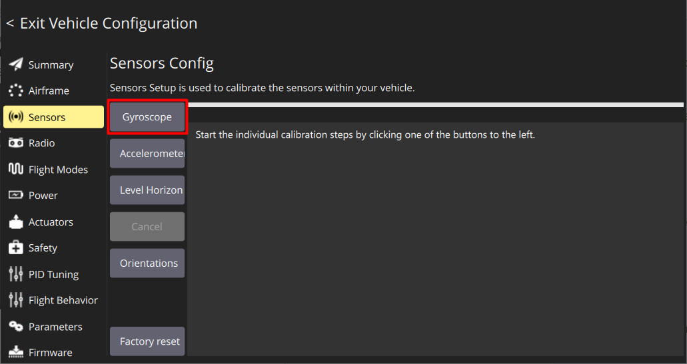

* Установите Обрик на ровную поверхность
* Нажмите **Ok**

    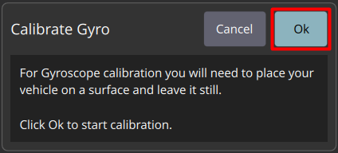

* Дождитесь окончания калибровки

  Если калибровка произведена успешна, то рамка самолета будет зеленой, а снизу надпись *“Completed”*, если при калибровке была ошибка - повторите ее заново

    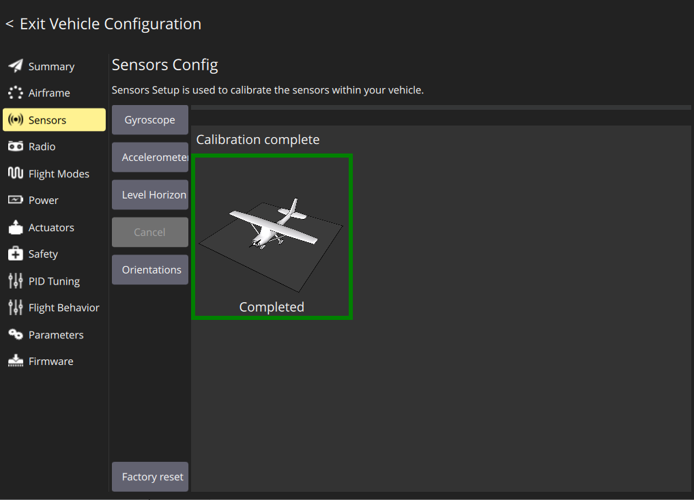

## Шаг 2: Калибровка Акселерометра

> **Note** При калибровке акселерометра необходимо устанавливать Обрик в каждую из указанных ориентаций и удерживать до световой индикации

* Выберите меню **Accelerometer**

    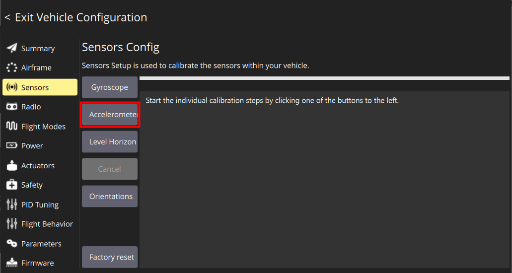

* Поставьте параметры **Autopilote Orientation** с параметрами **Pitch** 180°, **Yaw** 90° и нажмите **Ok**

    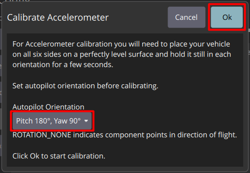

* Установите Обрик на шасси до появления желтой рамки

    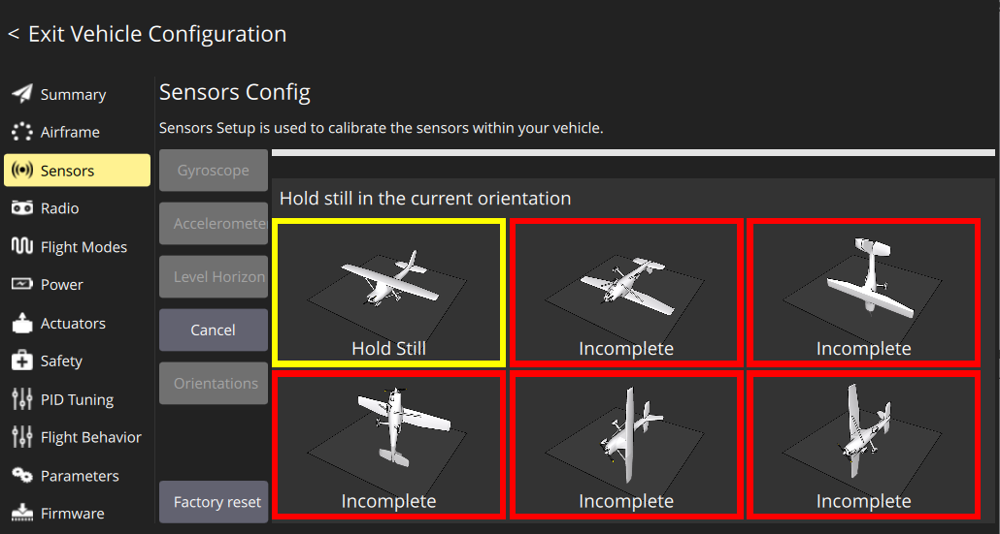

* Держите Обрик неподвижно до появления зеленой рамки

    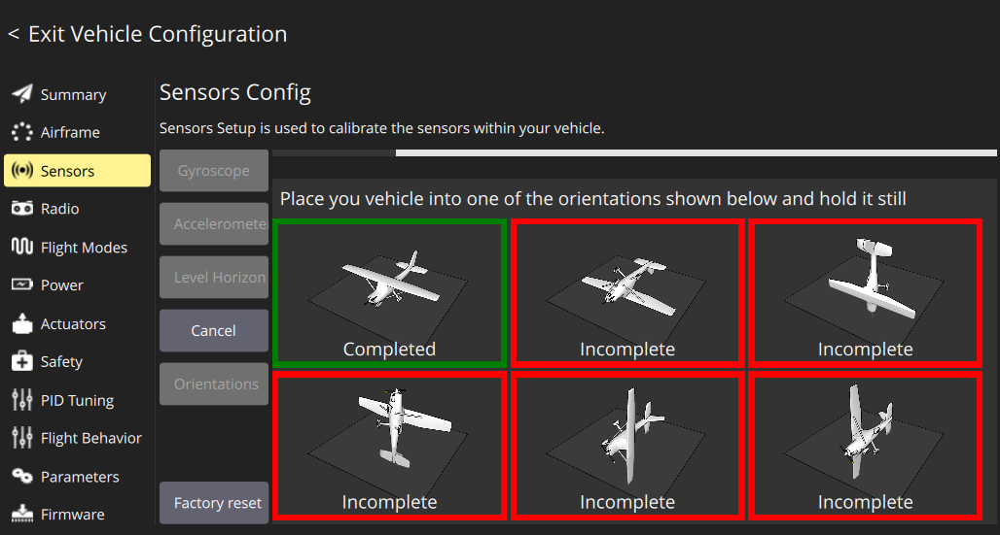

* Повторите для всех положений поочередно

  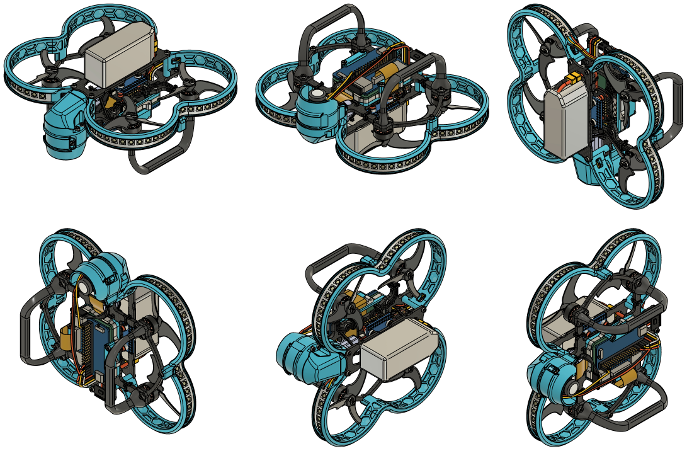

  Если калибровка произведена успешно, то все 6 рамок самолета будут зелеными, а снизу каждой будет надпись *“Completed”*, если при калибровке была допущена ошибка - калибровка сбросится, повторите ее заново.

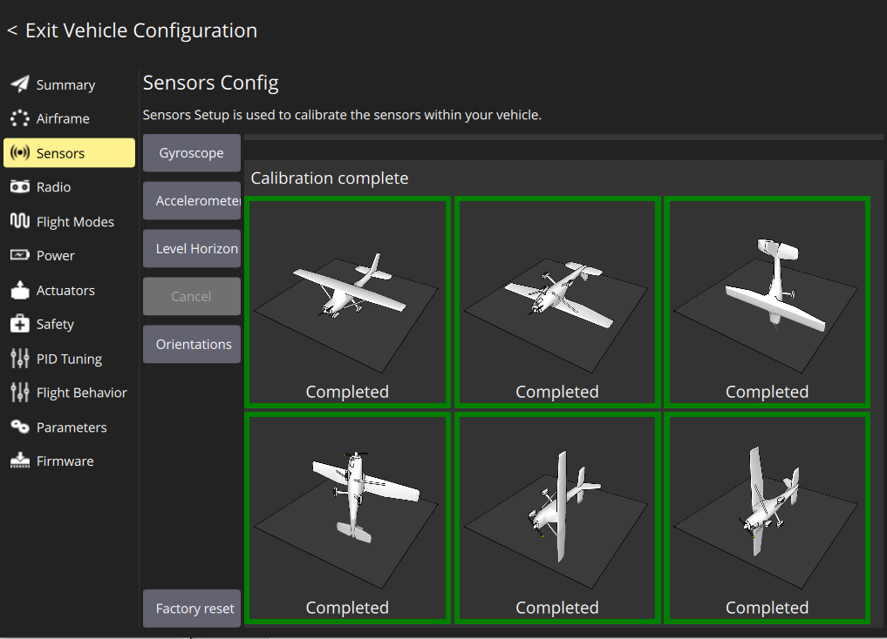

## Шаг 3: Калибровка уровня горизонта

> **Note** От точности калибровки уровня горизонта зависит качество полета

* Выберите меню **Level Horizon**

    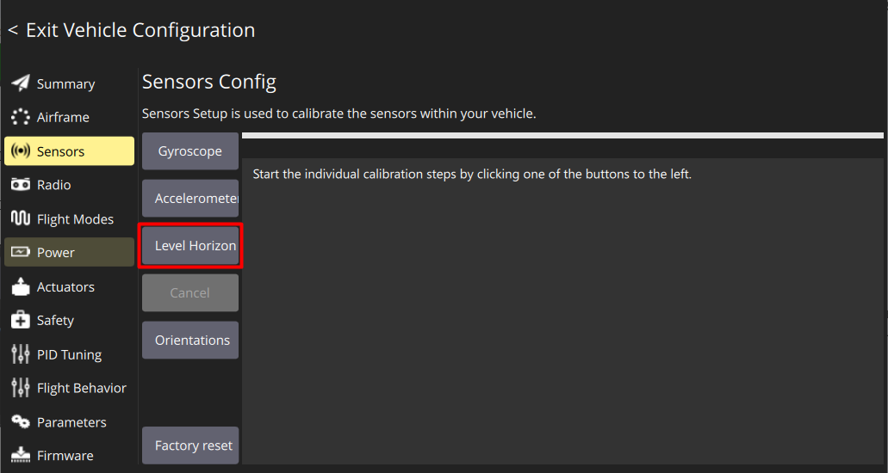

* Установите Обрик на ровную поверхность
* Нажмите **Ok**

    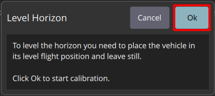

* Дождитесь окончания калибровки
