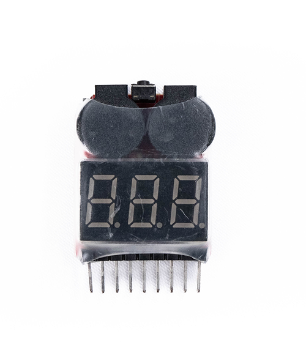
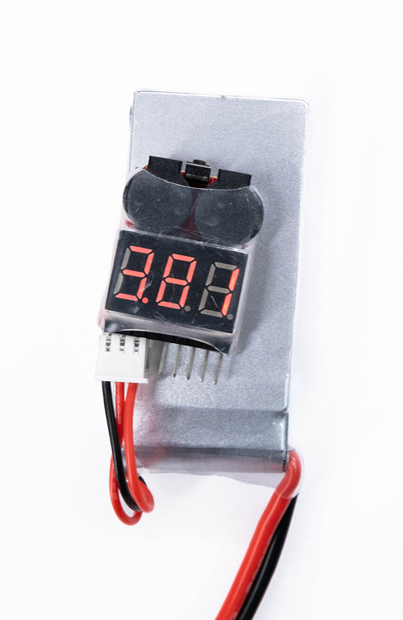
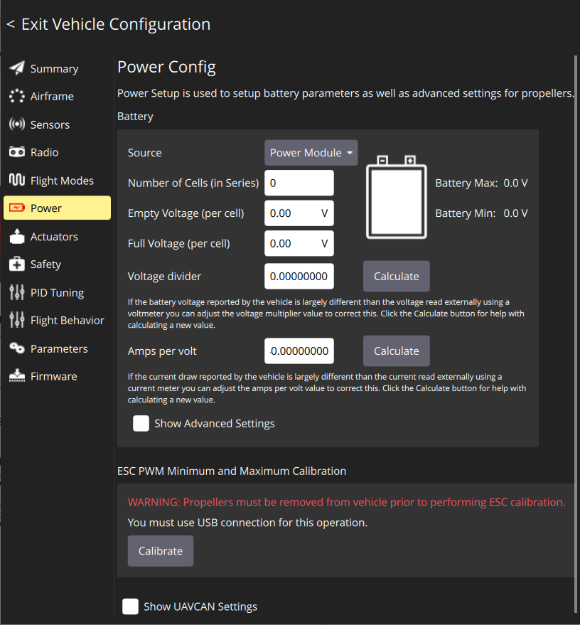
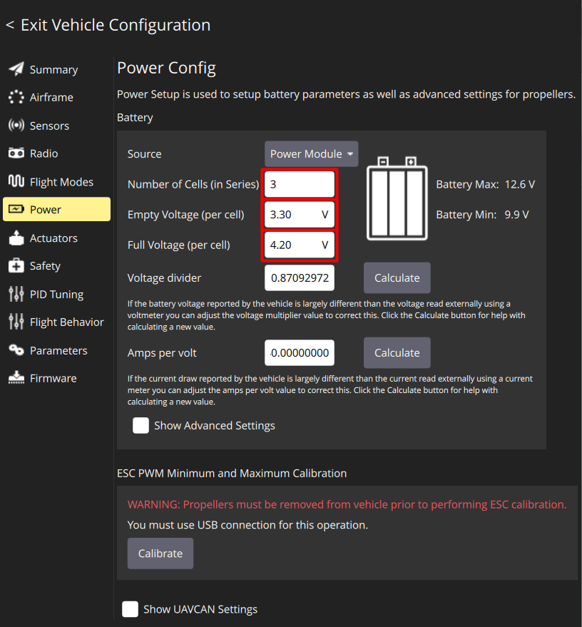
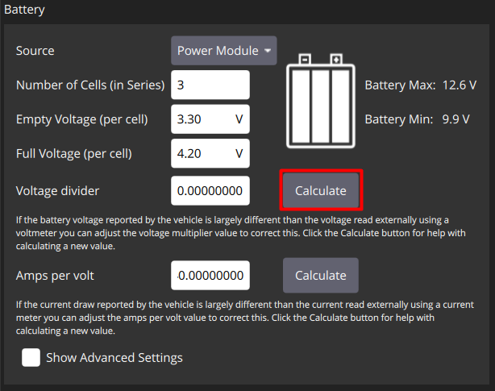
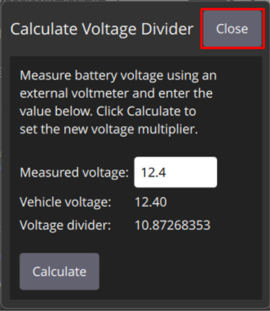

# Настройка питания

## Индикатор напряжения

Для того, чтобы не испортить аккумулятор, рекомендуется использовать индикатор напряжения (пищалка).

Для настройки пищалки подключите ее к балансировочному разъему аккумулятора. Теперь, нажимая на кнопку в основании будет изменяться минимальное напряжение на ячейках. Оптимальное значение минимального напряжения является 3.5-3.6 V.

> **Caution** Перед настройкой питания убедитесь, что пропеллеры не установлены на моторах

Во вкладке **Power** настраиваются параметры АКБ

> **Caution** Обращайте внимание на маркировку АКБ - свертесь в [параметрами](akb.md#2-напряжение-ячеек-таблица-значений)

* Установите параметр **Number of cells** в соответствии с количеством ячеек в АКБ (3S для Обрик)
* Установите параметр **Empty Voltage** (минимальное напряжение для ячейки АКБ) значение 3.30V (для LiPo АКБ)
* Установите параметр **Full Voltage** (максимальное напряжение для ячейки АКБ) значение 4.20V (для LiPo АКБ)

    

Откалибруйте делитель напряжения:

* Подключите индикатор напряжения к балансировочному разъему АКБ
* Нажмите кнопку **Calculate** напротив надписи **Voltage Divider**

    

* Введите в открывшемся поле суммарное значение напряжения с индикатора напряженияй
* Нажмите **Close**, чтобы сохранить рассчитанное значение
* В случае отсутствия индикатора напряжения или невозможности ручной калибровки, установите усредненное значение делителя напряжения для комплекта Обрика (**Voltage divider** = 11)

    

## Проверка

После настройки и калибровки полетного контроллера перейдите на вкладку **Summary**. Все пункты должны быть отмечены зеленым маркером

