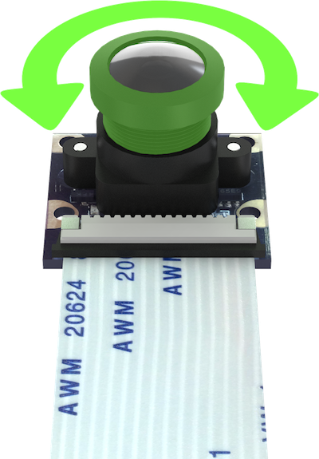
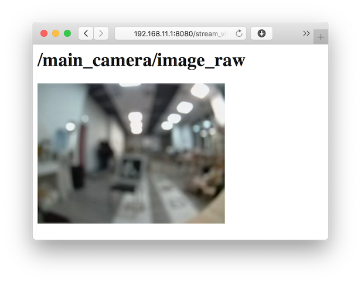
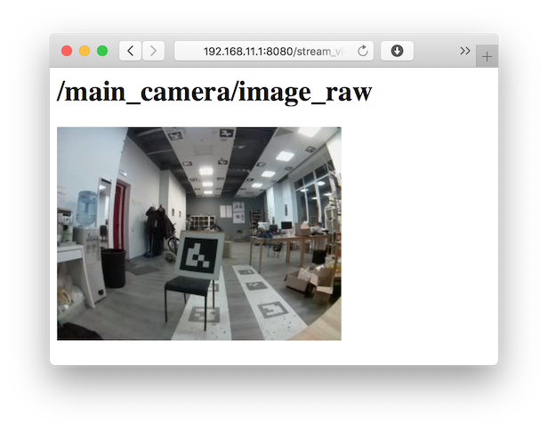

# Автономный полет (OFFBOARD)

Высокоуровневая Python-библиотека для управления дроном через ROS 2 сервисы:

- **`offboard_control`** — полёт, позиции, скорости, флип, телеметрия.
- **`fmu_calibration_control`** — дизарм, force_disarm, kill switch, калибровки.
- **`led_control`** (опционально) — управление светодиодной лентой: эффекты и цвет отдельных светодиодов.

Они берут на себя сложные детали — взаимодействие с полетным контроллером и пересчёт координат между разными системами (фреймами).

Работает поверх `rclpy` и уже запущенных нод PX4/Offboard/Calib/led_control.

Проверка:

```bash
python3 -c "import sverk_interfaces; print(sverk_interfaces)"
```

## Настройка фокуса камеры {#focus}

Для успешного осуществления полетов с использованием камеры, необходимо настроить фокус камеры.



1. Откройте трансляцию изображения с камеры используя web_video_server.
2. С помощью вращения объектива камеры добейтесь максимальной резкости деталей (предпочтительно на расстоянии предполагаемой высоты полета – 2–3 м).

|Расфокусированное изображение|Сфокусированное изображение|
|-|-|
|||
---

## 1. Быстрый старт

### 1.1. Простейший пример

```python
import time
import sverk_interfaces

# Создаём клиентский объект
drone = sverk_interfaces.init(Nodename="drone_controll")

# Взлёт на 1.5 м относительно корпуса (frame_id='body'), с auto_arm
resp = drone.controll.navigate(
    x=0.0,
    y=0.0,
    z=1.5,
    yaw=0.0,
    speed=1.0,
    frame_id="body",
    auto_arm=True,
)
print("navigate:", resp.success, resp.message)

time.sleep(5.0)

# Посадка
land_resp = drone.controll.land()
print("land:", land_resp.success, land_resp.message)

# Явно освобождаем ресурсы (опционально, но хорошо)
drone.close()

```

### 1.2. Основные атрибуты

- **`drone.controll`** — доступ к сервисам `offboard_control`:
    <details>
    <summary><code>navigate</code> — полет в точку</summary>

    Базовая команда для полета в указанную точку. Команда отправляется мгновенно, и программа продолжает выполнение (не ждет достижения цели).

    * `x`, `y`, `z` (`float`) — координаты цели в метрах
    * `yaw` (`float`) — целевой курс в радианах (по умолчанию 0.0)
    * `speed` (`float`) — скорость полета в м/с (по умолчанию 0.5)
    * `frame_id` (`str`) — система координат: `'map'`, `'body'`, `'aruco_map'` и др. (по умолчанию `'map'`)
    * `auto_arm` (`bool`) — если `True`, автоматически переведет дрон в режим OFFBOARD и включит моторы (по умолчанию `False`)
    </details>

    <details>
    <summary><code>navigate_wait</code> — полет в точку с ожиданием</summary>

    Аналог `navigate`, но функция блокирует выполнение программы до достижения цели с заданной точностью.

    * `x`, `y`, `z` (`float`) — координаты цели в метрах
    * `yaw` (`float`) — целевой курс в радианах (по умолчанию 0.0)
    * `speed` (`float`) — скорость полета в м/с (по умолчанию 0.5)
    * `frame_id` (`str`) — система координат (по умолчанию `'map'`)
    * `auto_arm` (`bool`) — автоматический взлет (по умолчанию `False`)
    * `tolerance` (`float`) — допустимая погрешность прибытия в метрах (по умолчанию 0.2)
    * `check_interval` (`float`) — частота проверки положения в секундах (по умолчанию 0.2)
    * `timeout` (`float`) — максимальное время ожидания в секундах (по умолчанию `None` — бесконечно)
    </details>

    <details>
    <summary><code>land</code> — посадка</summary>

    Команда на посадку. Переводит дрон в режим посадки (AUTO.LAND в PX4).

    * Нет параметров
    </details>

    <details>
    <summary><code>get_telemetry</code> — получение телеметрии</summary>

    Получение текущего состояния дрона: координаты, скорость, угол, заряд батареи, режим и т.д.

    * `frame_id` (`str`) — система координат для положения (по умолчанию `'map'`)
    * `timeout` (`float`) — таймаут ожидания ответа в секундах (по умолчанию 1.0)
    </details>

    <details>
    <summary><code>set_altitude</code> — изменение высоты</summary>

    Изменить только целевую высоту, сохраняя текущие координаты X, Y и курс.

    * `z` (`float`) — новая высота в метрах
    * `frame_id` (`str`) — система координат для высоты
    </details>

    <details>
    <summary><code>set_yaw</code> — изменение курса</summary>

    Повернуть дрон на заданный угол, не меняя его положение в пространстве.

    * `yaw` (`float`) — целевой курс в радианах
    * `frame_id` (`str`) — система координат для курса
    </details>

    <details>
    <summary><code>clear_yaw_override</code> — сброс управления курсом</summary>

    Снять все ограничения/задания по курсу, вернув автоматическое управление.

    * Нет параметров
    </details>

    <details>
    <summary><code>set_yaw_rate</code> — вращение с постоянной скоростью</summary>

    Вращение вокруг вертикальной оси с постоянной угловой скоростью.

    * `yaw_rate` (`float`) — угловая скорость в радианах/секунду (положительная = против часовой стрелки)
    </details>

    <details>
    <summary><code>set_position</code> — задание целевой позиции</summary>

    Низкоуровневая команда для задания конкретной точки, в которую дрон должен лететь. Используется для частого обновления цели.

    * `x`, `y`, `z` (`float`) — координаты цели в метрах
    * `yaw` (`float`) — целевой курс в радианах (по умолчанию 0.0)
    * `frame_id` (`str`) — система координат (по умолчанию `'map'`)
    * `auto_arm` (`bool`) — автоматический взлет (по умолчанию `False`)
    </details>

    <details>
    <summary><code>set_velocity</code> — управление по скорости</summary>

    Задать целевые скорости по осям. Дрон будет лететь с указанными скоростями, пока не получит новую команду.

    * `vx`, `vy`, `vz` (`float`) — скорости в м/с
    * `yaw` (`float`) — целевой курс в радианах (по умолчанию 0.0)
    * `frame_id` (`str`) — система координат для скоростей и курса (по умолчанию `'map'`)
    * `auto_arm` (`bool`) — автоматический взлет (по умолчанию `False`)
    </details>

    <details>
    <summary><code>set_attitude</code> — управление по углам</summary>

    Низкоуровневое управление углами наклона (крен, тангаж) и газом. Аналог ручного управления в стабилизированном режиме.

    * `roll`, `pitch`, `yaw` (`float`) — целевые углы в радианах
    * `thrust` (`float`) — газ от 0 до 1
    * `frame_id` (`str`) — система координат для yaw
    * `auto_arm` (`bool`) — автоматический взлет (по умолчанию `False`)
    </details>

    <details>
    <summary><code>set_rates</code> — управление по угловым скоростям</summary>

    Самый низкоуровневый режим — задание угловых скоростей вращения и газа. Используется для акробатических трюков.

    * `roll_rate`, `pitch_rate`, `yaw_rate` (`float`) — угловые скорости в рад/с
    * `thrust` (`float`) — газ от 0 до 1
    * `auto_arm` (`bool`) — автоматический взлет (по умолчанию `False`)
    </details>

    <details>
    <summary><code>flip</code> — выполнение флипа</summary>

    Автоматическое выполнение кувырка (флипа) вокруг выбранной оси.

    * `axis` (`str`) — ось вращения: `'roll'`, `'pitch'` или `'yaw'`
    * `vz` (`float`) — скорость подъема перед флипом (м/с)
    * `climb_duration` (`float`) — длительность подъема (сек)
    * `rate` (`float`) — угловая скорость вращения (рад/с)
    * `target_angle` (`float`) — целевой угол поворота (обычно 2π для полного оборота)
    * `thrust` (`float`) — тяга во время вращения (0.1-0.3)
    * `auto_arm` (`bool`) — автоматический взлет (по умолчанию `False`)
    </details>

- **`drone.fcu`** — доступ к `fmu_calibration_control`:
    <details>
    <summary><code>disarm</code> — выключение моторов</summary>

    Штатное выключение моторов. Работает только если дрон на земле.

    * Нет параметров
    </details>

    <details>
    <summary><code>force_disarm</code> — принудительное выключение</summary>

    Принудительно выключить моторы, даже если дрон в воздухе (аварийная остановка).

    * Нет параметров
    </details>

    <details>
    <summary><code>kill_switch</code> — аварийный выключатель</summary>

    Мгновенная остановка всех моторов (аварийное отключение).

    * Нет параметров
    </details>

    <details>
    <summary><code>calibrate_gyro</code> — калибровка гироскопа</summary>

    Калибровка гироскопа. Дрон должен быть неподвижен.

    * Нет параметров
    </details>

    <details>
    <summary><code>calibrate_mag</code> — калибровка магнитометра (компаса)</summary>

    Калибровка компаса. Требуется вращать дрон вокруг всех осей.

    * Нет параметров
    </details>

    <details>
    <summary><code>calibrate_baro</code> — калибровка барометра</summary>

    Калибровка датчика давления (высотомера).

    * Нет параметров
    </details>

    <details>
    <summary><code>calibrate_temperature</code> — температурная калибровка</summary>

    Калибровка датчиков с учетом температуры.

    * Нет параметров
    </details>

    <details>
    <summary><code>calibrate_accel</code> — калибровка акселерометра</summary>

    Самая частая калибровка. Требуется поставить дрон в 6 положений (на все стороны).

    * Нет параметров
    </details>

    <details>
    <summary><code>calibrate_level</code> — калибровка горизонта</summary>

    Установка текущего горизонта как нулевого уровня.

    * Нет параметров
    </details>

- **`drone.led`** (если установлен пакет `led_interfaces`) — доступ к ноде 
    <details>
    <summary><code>set_effect</code> — установка эффекта светодиодной ленты</summary>

    Задать эффект свечения для всей ленты.

    * `effect` (`str`) — название эффекта (`'fill'`, `'blink'`, `'fade'`, `'rainbow'`, `'rainbow_fill'`)
    * `r`, `g`, `b` (`int`) — цвет (0-255)
    </details>

    <details>
    <summary><code>set_leds</code> — управление отдельными светодиодами</summary>

    Задать цвет для каждого светодиода индивидуально.

    * `leds` (`list`) — список кортежей `(индекс, r, g, b)` или словарей
    </details>

    <details>
    <summary><code>get_state</code> — получение состояния ленты</summary>

    Прочитать текущее состояние всех светодиодов.

    * `timeout` (`float`) — таймаут ожидания в секундах
    </details>

Все методы синхронные: ждут ответа сервиса и возвращают `Response` соответствующего ROS-сервиса.

---

## 2. Примеры использования

Помимо сниппетов ниже, в пакете есть готовые **примерные программы** в каталоге:

`src/sverk_drone/sverk_interfaces/examples`

Кратко:

- `simple_takeoff_land.py` — взлёт, пролёт 1 м вперёд по `body`, посадка.
- `square_mission.py` — квадрат в плоскости `map` с возвратом в стартовую точку.
- `cube_mission.py` — объёмная фигура «куб» в системе `body` (два квадрата на разных высотах).
- `circle_trajectory.py` — движение по окружности через `set_position`.
- `telemetry_monitor.py` — простой монитор телеметрии в консоль.
- `safety_and_calibration.py` — примеры дизарма и калибровок через `drone.fcu`.
- `led_effects.py` — эффекты светодиодной ленты (заливка, мигание, радуга и т.д.).
- `led_set_leds.py` — низкоуровневое управление отдельными светодиодами и чтение состояния ленты.

```bash
cd ~/sverk_ws
source install/setup.bash
python3 src/sverk_drone/sverk_interfaces/examples/simple_takeoff_land.py
```

---

### 2.1. Телеметрия

```python
import sverk_interfaces

drone = sverk_interfaces.init(Nodename="drone_telemetry")

t = drone.controll.get_telemetry(frame_id="map", timeout=1.0)
print(
    "connected:", t.connected,
    "armed:", t.armed,
    "mode:", t.mode,
    "pos:", (t.x, t.y, t.z),
    "yaw:", t.yaw,
)

drone.close()
```

### 2.2. Полёт по карте и посадка

```python
import time
import sverk_interfaces

drone = sverk_interfaces.init(Nodename="simple_mission")

# Взлёт и полёт к точке в map
drone.controll.navigate(
    x=1.0, y=0.0, z=1.0,
    yaw=0.0,
    speed=0.5,
    frame_id="map",
    auto_arm=True,
)

time.sleep(10.0)

drone.controll.land()
drone.close()
```

### 2.3. Force disarm и калибровка

```python
import sverk_interfaces

drone = sverk_interfaces.init(Nodename="safety_tools")

# Принудительный дизарм (в т.ч. в воздухе)
drone.fcu.force_disarm()

# Калибровка акселерометра (в pre-arm)
    drone.fcu.calibrate_accel()

drone.close()
```

### 2.4. Светодиодная лента (LED)

Для работы с LED нужна запущенная нода `led_control` и пакет `led_interfaces` в workspace. Тогда `drone.led` доступен; иначе `drone.led` — `None`.

**Эффекты и цвет (сервис `/led/set_effect`):**

```python
import time
import sverk_interfaces

drone = sverk_interfaces.init(Nodename="led_demo")
if drone.led:
    drone.led.set_effect("fill", r=255, g=0, b=0)      # заливка красным
    time.sleep(2.0)
    drone.led.set_effect("fade", r=0, g=255, b=0)       # плавный переход к зелёному
    time.sleep(2.0)
    drone.led.set_effect("rainbow")                      # радуга по ленте
else:
    print("LED API недоступен (нет led_interfaces или нода led_control не запущена)")
drone.close()
```

**Отдельные светодиоды (сервис `/led/set_leds`) и состояние ленты:**

```python
import sverk_interfaces

drone = sverk_interfaces.init(Nodename="led_demo")
if drone.led:
    # Список (index, r, g, b) или словари {"index", "r", "g", "b"}
    drone.led.set_leds([
        (0, 255, 0, 0),
        (1, 0, 255, 0),
        (2, 0, 0, 255),
    ])
    state = drone.led.get_state(timeout=2.0)
    if state:
        print("Светодиодов в ленте:", len(state.leds))
drone.close()
```

Доступные эффекты: `fill`, `blink`, `blink_fast`, `fade`, `wipe`, `flash`, `rainbow`, `rainbow_fill`. Константа `sverk_interfaces.LED_EFFECTS` содержит все имена.

---

## 3. Управление жизненным циклом

- `sverk_interfaces.init(...)`:
  - если `rclpy` ещё не инициализирован, вызывает `rclpy.init()`;
  - создаёт `rclpy.Node` с указанным именем (`Nodename` / `node_name`);
  - возвращает объект `DroneInterfaces`.
- `drone.close()`:
  - уничтожает созданный нод;
  - при отсутствии других инстансов библиотеки инициализированный библиотекой `rclpy` будет корректно остановлен (`rclpy.shutdown()`).
- При завершении процесса:
  - срабатывает `atexit`‑обработчик, который вызывает `close()` для всех активных инстансов.

Обычному пользователю достаточно вызывать `drone.close()` в конце программы, остальное библиотека сделает сама.

---

## 4. Настройка значений по умолчанию (`configure_defaults`)

Для упрощения использования библиотека позволяет задать **общие дефолты** для всех
основных методов `drone.controll` (navigate, navigate_wait, set_position, set_velocity,
set_attitude, set_rates, flip, land, get_telemetry и т.д.).

Пример:

```python
import sverk_interfaces

drone = sverk_interfaces.init(Nodename="drone_controll")

# Один раз настраиваем "режим по умолчанию":
drone.controll.configure_defaults(
    frame_id="body",   # все команды без явного frame_id будут относиться к body
    yaw=0.0,           # yaw по умолчанию
    speed=0.5,         # скорость по умолчанию для navigate/navigate_wait
    auto_arm=False,    # auto_arm по умолчанию (например, выключен)
    timeout=60.0,      # общий таймаут по умолчанию
    tolerance=0.25,    # допуск по расстоянию для navigate_wait
    check_interval=0.2 # период опроса телеметрии в navigate_wait
)

# Теперь можно опускать большинство аргументов:
drone.controll.navigate_wait(x=0.0, y=0.0, z=1.5)   # frame_id="body", speed=0.5, yaw=0.0
drone.controll.set_position(z=1.0)                  # полёт на 1 м вверх в body с yaw=0.0
drone.controll.set_velocity(vx=1.0, vy=0.0, vz=0.0) # вперёд по body с yaw=0.0
```

Внутри `OffboardControlAPI` есть поля с текущими дефолтами:

- `drone.controll.default_frame_id`
- `drone.controll.default_yaw`
- `drone.controll.default_speed`
- `drone.controll.default_auto_arm`
- `drone.controll.default_timeout`
- `drone.controll.default_tolerance`
- `drone.controll.default_check_interval`

Их можно менять как напрямую, так и через `configure_defaults(...)`.

**Важно:** если пользователь не передал параметр (`frame_id`, `yaw`, `speed`,
`auto_arm`, `timeout` и т.п.), он **не останется неопределённым** — всегда
подставится одно из этих дефолтных значений. Это позволяет задать безопасный
«профиль» поведения дрона по умолчанию и не бояться неполных вызовов
со стороны начинающих пользователей.

---

## 5. DEV‑секция (для разработчиков)

Этот раздел для тех, кто расширяет библиотеку или интегрирует дополнительные ROS‑сервисы.

### 5.1. Добавление нового семейства сервисов

Внутри `DroneInterfaces` есть метод `add_family`, который использует класс `GenericServiceFamily`:

```python
from my_pkg.srv import DoThing
import sverk_interfaces

drone = sverk_interfaces.init(Nodename="dev_client")

my_family = drone.add_family(
    name="my",                 # drone.my
    namespace="/my_node_ns",   # префикс для сервисов
    services={
        "do_thing": DoThing,   # имя сервиса -> тип srv
    },
)

req = DoThing.Request()
req.param = 123
resp = my_family.call("do_thing", req, timeout=1.0)
print(resp)

drone.close()
```

Внутри `GenericServiceFamily`:

- создаются клиенты `rclpy` для каждого сервиса (`node.create_client`),
- метод `call(name, request, timeout)` оборачивает общий `_call_service(...)`.

Это удобный шаблон для быстрого подключения новых ROS‑сервисов без написания отдельного API‑класса.

### 5.2. Расширение `OffboardControlAPI` / `FmuCalibrationAPI` / `LedAPI`

Для добавления нового метода:

1. Убедитесь, что соответствующий сервис уже объявлен и запущен в ноде (`offboard_control` или `fmu_calibration_control`).
1. В `OffboardControlAPI.__init__` или `FmuCalibrationAPI.__init__`:
   - добавьте `self._имя = node.create_client(SrvType, _service_name(..., "имя"))`.
2. Реализуйте метод‑обёртку:
   - создайте `request = SrvType.Request()`,
   - заполните поля,
   - верните `_call_service(self._node, self._имя, request, timeout)`.

### 5.3. Неймспейсы

Параметры `init`:

```python
drone = sverk_interfaces.init(
    Nodename="drone_controll",
    offboard_namespace="",                   # по умолчанию сервисы /navigate, /land, ...
    fcu_namespace="/fmu_calibration_control", # по умолчанию
    led_namespace="led",                     # по умолчанию /led/set_effect, /led/set_leds, /led/state
)
```

Можно переназначить, если `offboard_control`, `fmu_calibration_control` или нода LED запущены в другом namespace.

### 5.4. Поведение rclpy

- `_ensure_rclpy_init()`:
  - вызывает `rclpy.init()` только если он ещё не был вызван;
  - помечает, что `rclpy` принадлежит библиотеке.
- `_maybe_rclpy_shutdown()`:
  - вызывает `rclpy.shutdown()` только когда:
    - нет живых `DroneInterfaces`,
    - инициализация `rclpy` была сделана библиотекой.

Если приложение само управляет жизненным циклом `rclpy` (например, создаёт свои ноды и свой executor), библиотека не будет мешать, пока не будет создана/закрыта последняя её инстанция.

### 5.5. Пересборка

Типичный цикл:

```bash
cd ~/sverk_ws
colcon build --packages-select sverk_interfaces
source install/setup.bash
```