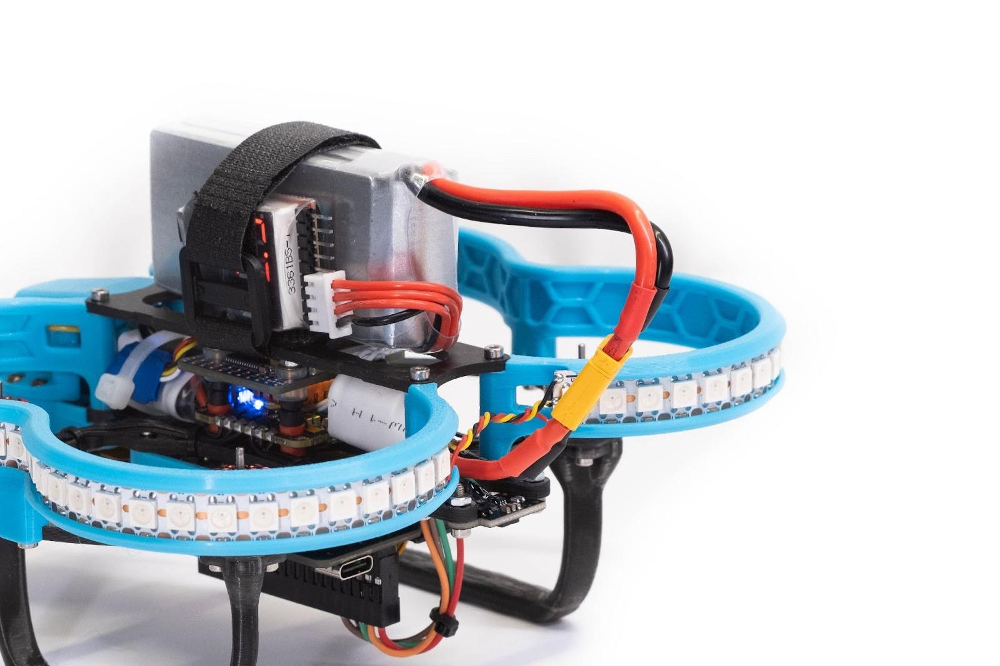
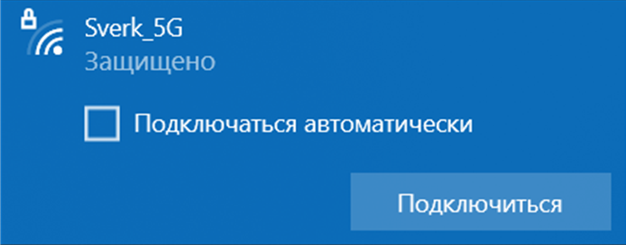
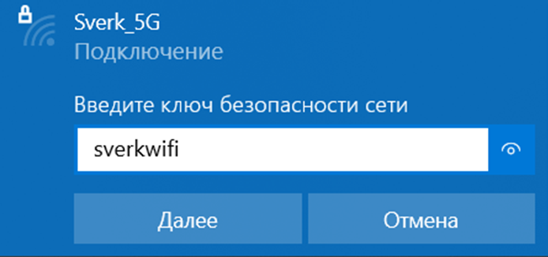
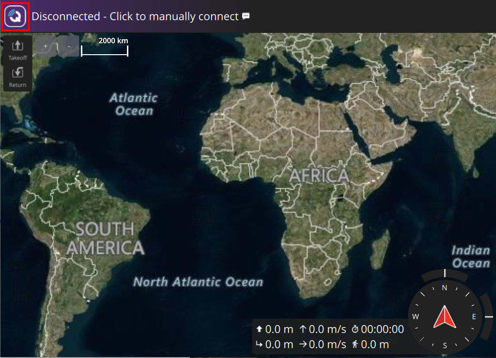
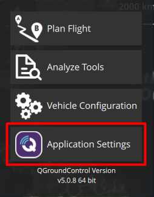
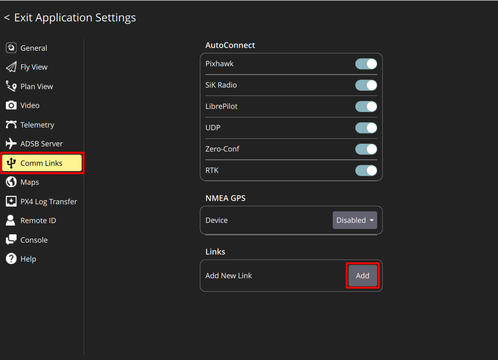
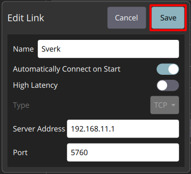
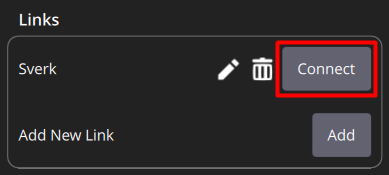

<!-- markdownlint-disable MD044 -->
# Подключение к QGroundControl

После включения бортовой компьютер либо раздаёт локальную Wi-Fi точку доступа, либо подключается к роутеру.

В обоих случаях доступны:

* Веб-доступ к инструментам управления и мониторинга.
* Сквозной канал связи (через TCP) между программой QGroundControl (QGC) на вашем ПК и полетным контроллером PX4 внутри Обрика.

## Безопасное включение дрона

* **Убедитесь, что воздушные винты сняты**

* Включите Обрик используя АКБ либо кабель USB Type-C

> **Hint** Рекомендуем использовать USB для первого подключения

  

* Через 30-60 секунд загорится светодиодная лента:
 <!-- * Сценарий точки доступа: Обрик раздаёт Wi-Fi и в списке Wi-Fi сетей появится сеть Sverk-xxxxx

> **Info** SSID (имя сети) Sverk-xxxxх, где xxxxх – 5 случайных цифры, назначаемых при первом включении бортового компьютера.-->

* Сценарий роутера: Обрик подключится к существующей сети Wi-Fi **Poletka**

<!--> **Info** Настройте на телефоне и включите точку доступа с названием **Poletka** и паролем **poletka1**-->

## Шаг 1: Подключитесь к Обрику
<!--Сценарий точки доступа:
* На вашем компьютере/ноутбуке найдите в списке Wi-Fi сеть с именем **Sverk-xxxxx** (например, Sverk-58421)

  

* Подключитесь к сети, используя пароль: **sverkwifi**

  

> **Info** IP-адрес Обрика будет статичным `192.168.11.1`-->

Сценарий роутера:
* На вашем компьютере/ноутбуке найдите в списке Wi-Fi сеть с именем **Poletka**
* Подключитесь к сети, используя пароль: **poletka1**
* Чтобы узнать IP вашего Обрика:
  * Скачайте и установите программу [Advanced IP Scanner](https://www.advanced-ip-scanner.com/ru/)
  * После запуска программы вам нужно указать, какие IP-адреса следует сканировать. Для этого есть несколько способов:
    * Автоматический выбор: Нажмите кнопку "IP" на панели инструментов. Программа автоматически определит вашу сеть и подставит правильный диапазон адресов (например, 192.168.1.1 - 192.168.1.255) .
    * Ручной ввод: Если вы знаете структуру своей сети, вы можете ввести диапазон вручную в специальное поле .
  * Нажмите **Сканировать** 
  * Дождитесь окончания сканирования и выберите IP-адрес вашего Обрика

## Шаг 2. Подключение полетного контроллера к QGC по Wi-Fi

> **Hint** По умолчанию на Обрике настроена возможность подключения QGC по протоколу TCP.

* Запустите программу **QGC**
* Нажмите на **логотип QGC** в левом верхнем углу

  

* В открывшемся списке выберите **Application Settings**

  

* Выберите меню **Comm Links** и в окне **Links** нажмите **Add**, чтобы добавить новое подключение

  

* Введите параметры подключения:
  * **Name:** любое название по желанию, к примеру Sverk
  * Активируйте ползунок в поле **Automatically Connect on Start**
  * **Type:** TCP
  * **Host Address:** `IP-адрес вашего Обрика` <!--(для сценария точки доступа или IP из сценария роутера)-->
  * **TCP Port:** `14550`

  

* Нажмите **Save** для сохранения параметров и добавления нового подключения
* Выберите созданное подключение и нажмите **Connect**

  

> **Hint** Теперь, если Обрик включен и раздаёт Wi-Fi, он будет автоматически подключаться к QGC при запуске программы.
>
> Если ползунок в поле Automatically Connect on Start не был активирован и при перезапуске QGC необходимо подключаться вручную

## Подключение вручную

* На главном экране QGC нажмите на **Click to manually connect**

  

* Нажмите на название вашего подключения к Обрику

  

* В левом верхнем углу QGC пропадет надпись **DISCONNECTED**, появятся данные с датчиков (температура батареи, уровень сигнала и т.д.)
<!-- markdownlint-disable MD044 -->
