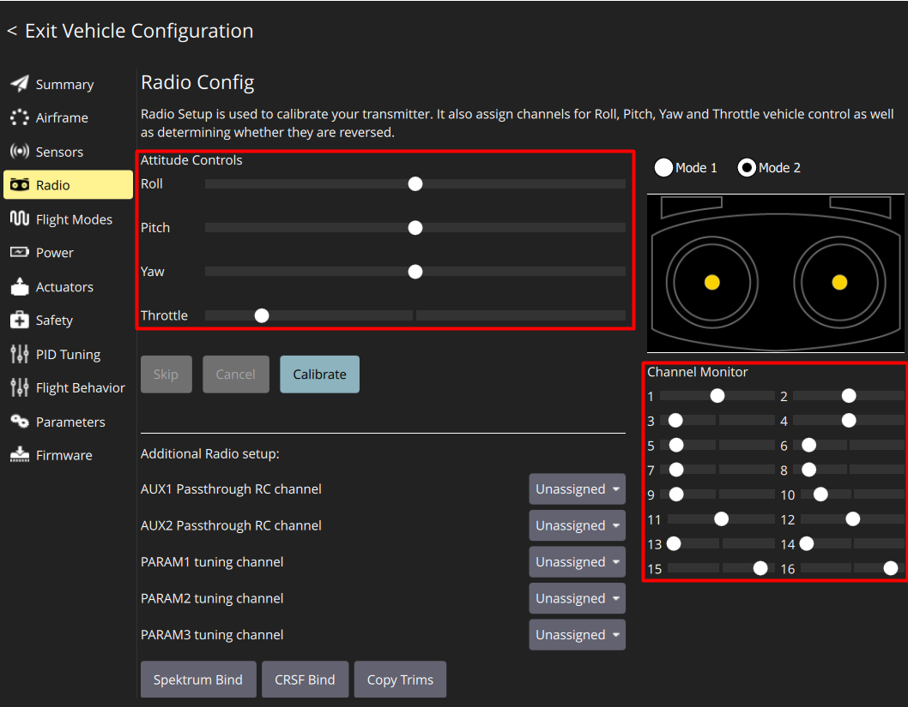
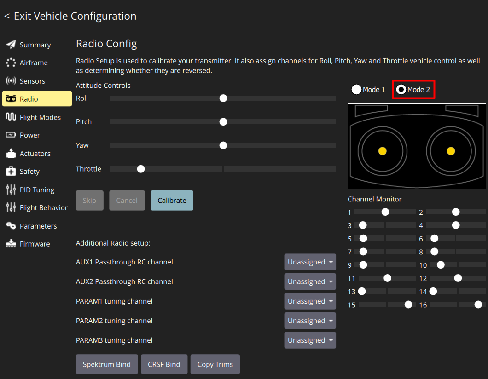
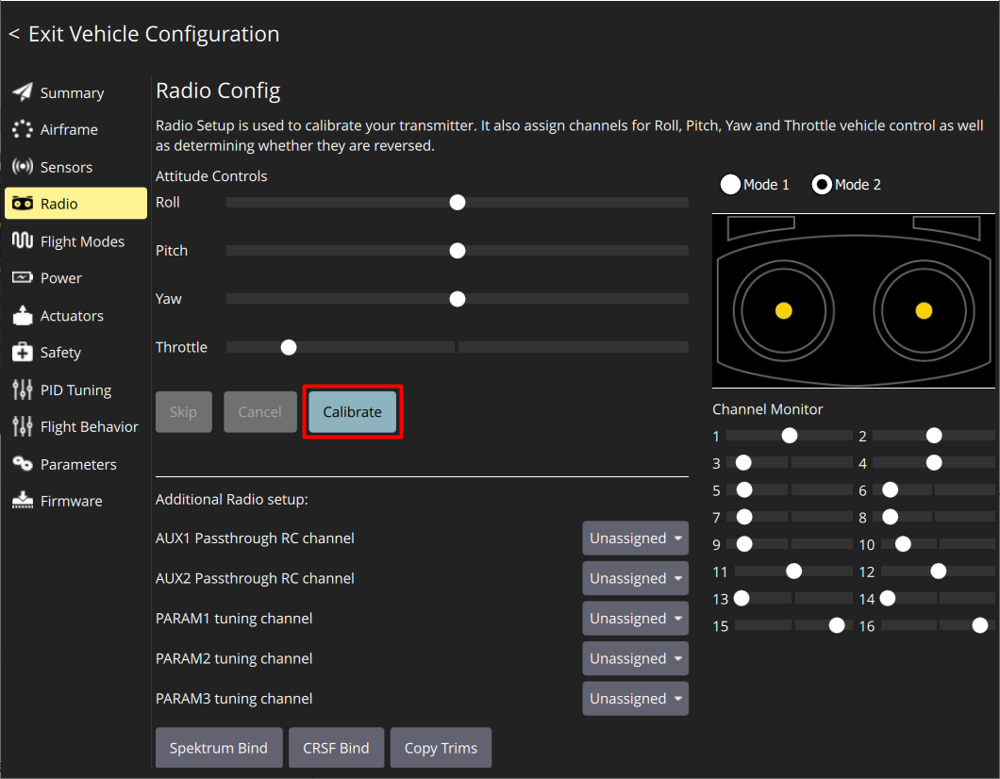
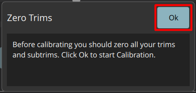
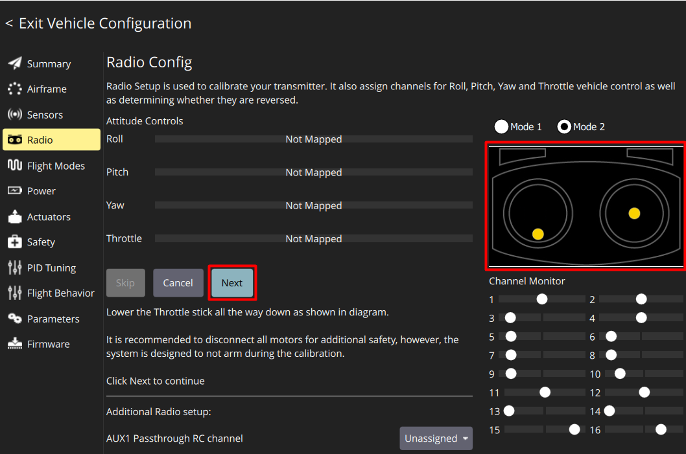
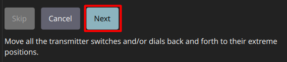
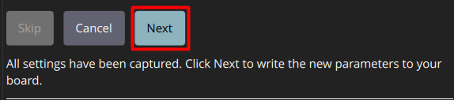
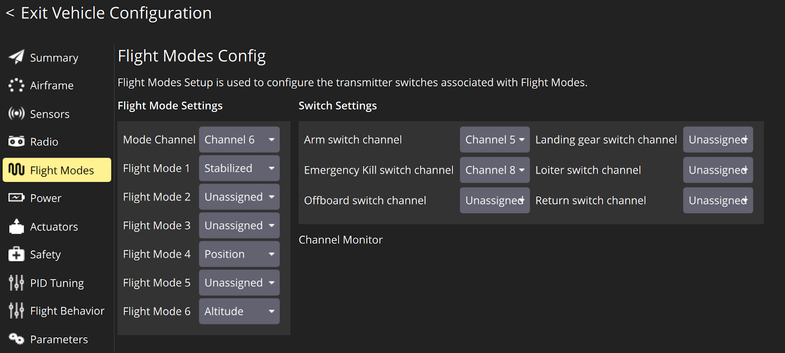
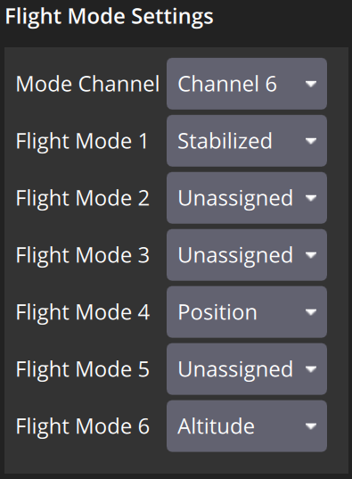
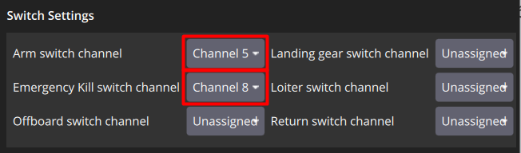

# Калибровка аппаратура управления

> **Caution** Перед подключением и калибровкой аппаратура управления убедитесь, что:
>
> * К коптеру не подключено внешнее питание от АКБ;
> * Пропеллеры не установлены на моторах.

Во вкладке **Radio** показывается то, как Обрик воспринимает положения элементов аппаратуры управления и соотношения их с каналами (с 1 по 16)

Radiomaster Pocket (аппаратура управления Обрика) имеет 10 каналов и следующее соотношение:

<table class="type_table">
    <tr>
        <td>1 - Roll</td>
        <td>2 - Pitch</td>
        <td>3 - Throttle</td>
        <td>4 - Yaw</td>
        <td>5 - SA</td>
    </tr>
    <tr>
        <td>6 - SB</td>
        <td>7 - SC</td>
        <td>8 - SD</td>
        <td>9 - SE</td>
        <td>10 - S1</td>
    </tr>
</table>

> **Note** Перемещая стики и изменяя положения переключателей можно в реальном времени увидеть соотношения их с каналами.
>
> Если на аппаратуре управления индикация показывает связь с Обриком, но QGC не воспринимает движения стиков, то на аппаратуре управления в меню SYS в разделе ExpressLRS измените параметр Model Match с положения off в положение on и снова в положение off.

Произведите калибровку:

* Выставьте **Mode 2**

    

* Нажмите кнопку **Calibrate**

    

* Установите триммеры **Throttle, Yaw, Pitch, Roll в 0** - переместите оба стика аппаратуры управления в центральное положение

  > **Hint** Правый стик автоматически центруется по обеим осям, чтобы установить левый стик по оси *Throttle* в центральное положение совместите риски на стике с рисками на корпусе

* Нажмите **Ok**

    

* Переведите левый стик (Throttle) в нижнее положение, как указано в окне справа и нажмите **Next**

    

* Повторяйте движения стиками вслед за анимацией и читайте подсказки

  > **Hint** Чем точнее вы будете следовать анимации, тем лучше будет произведена калибровка

* При появлении надписи *"Move all transmitter switches and/or dials back and forth to their extreme positions"* переключите **SA, SB, SC, SD, SE, SI** в их конечные положения
* Нажмите **Next**

    

* При появлении надписи *"All settings have been captured. Click Next to write the new parameters to your board"* нажмите **Next**

    

## Настройка полетных режимов

Во вкладке **Flight Modes** настраивается соотношение позиций переключателя SB и режимов полета, а также *Arm* (включение двигателей) и **Kill switch** (экстренное отключение двигателей)

Порядок настройки полетных режимов (поле **Flight Mode Settings**):

* **Mode Channel** установите **Channel 6** (переключатель SB)
* **Flight Mode 1** установите **Stabilized** (полет с автоматическим удержанием * горизонтального положения)
* **Flight Mode 4** установите **Position** (полет с автоматическим удержанием позиции)
* **Flight Mode 6** установите **Altitude** (полет с автоматическим удержанием высоты)

    

> **Caution** Желтым подсвечивается полетный режим (**Flight Mode**), который в данный момент соответствует позиции переключателя **SB** на аппаратуре управления

Порядок настройки переключателей (поле **Switch Settings**):

* **Arm switch channel** установите **Channel 5** (переключатель **SA**)
* **Emergency Kill switch channel** установите **Channel 8** (переключатель **SD**)

    
