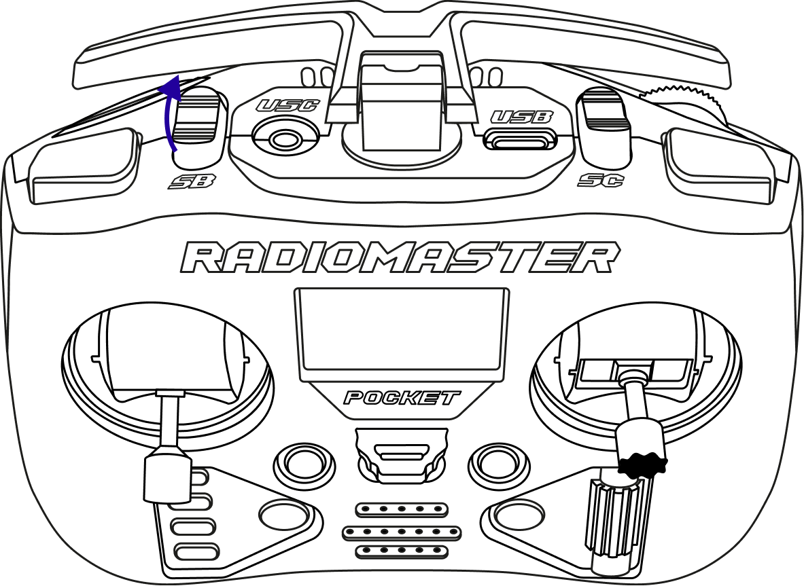
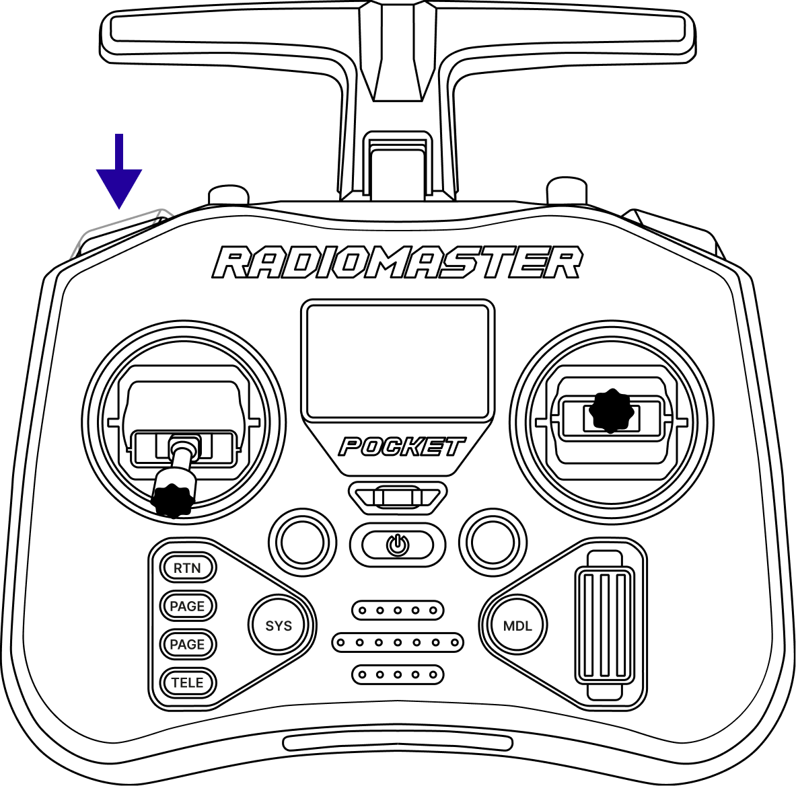
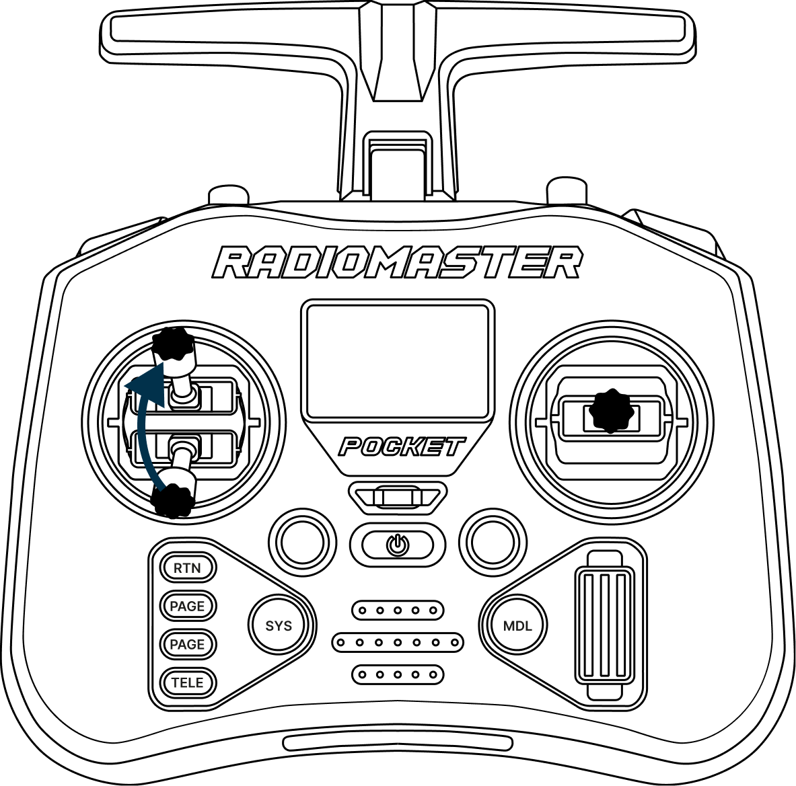

# Полет в режиме Position

> **Caution** Обязательный шаг для первого запуска автономного полета.

* [Включить аппаратуру управления](hardware_control.md)
* Перевести левый стик вниз стики управления, а правый в центральное положение

  

* На аппаратуре управления переведите переключатель **SB** в положение **Position** (как было настроено в разделе в [Настройка аппаратуры управления](controller_settings.md))

  

* Установите БВС на точку взлета

  

* Подключить АКБ к БВС

  

* Дождитесь полного включения БВС

> **Hint** БВС полностью включен если Wi-Fi сеть появилась для подключения

* Отойдите от БВС

## Запуск БВС и взлет

Кнопка **SA** - **Arm/Disarm** (включение/отключение моторов).

Переключатель **SB** - Выбор режима полёта.

Кнопка SD - Kill Switch (экстренное отключение моторов).

> **Caution** Убедитесь, что кнопка **SD (Kill switch)** отжата

Нажмите и отпустите кнопку **SA (Arm)**, моторы начнут вращаться на минимальных оборотах

> **Caution** Кнопка должна заблокироваться в нажатом положении

Плавно поднимите **левый стик** (Throttle) вверх. БВС взлетит и автоматически зависнет на высоте ~1 метра

Попробуйте немного подвигать **правым стиком** (Pitch/Roll). БВС будет двигаться в пространстве, а при отпускании стика — снова зависать на месте

> **Caution** Не улетайте далеко от поля меток, иначе БВС потеряется

## Посадка и выключение

* Для посадки плавно опустите **левый стик** (Throttle) вниз до полной посадки БВС
* Нажмите и отпустите кнопку **SA (Disarm)**

> **Caution** Кнопка должна выйти из заблокированного положения

* В целях безопасности нажмите и отпустите кнопку **SD (Kill Switch)**

> **Caution** Кнопка должна заблокироваться в нажатом положении

* Отключите АКБ от БВС
* Выключите аппаратуру управления
