# Аппаратура управления

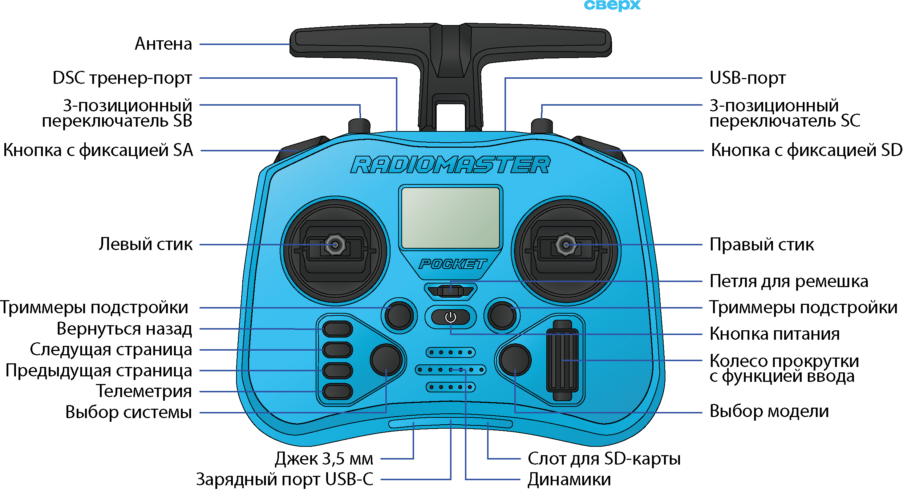

## Шаг 1. Настройка

*Перед полётами нужно настроить аппаратуру управления RadioMaster Pocket с использованием готовых файлов и произвести сопряжение с Обриком.*

* Снимите черные резиновые накладки с задней стороны аппаратуры управления
* Вставьте АКБ, соблюдая полярность
* Переведите все стики и переключатели аппаратуры управления в исходное положение:
  * Левый стик вниз
  * Тумблеры **SB, SC** от себя
  * Переключатели **SA, SD** в положение выкл.

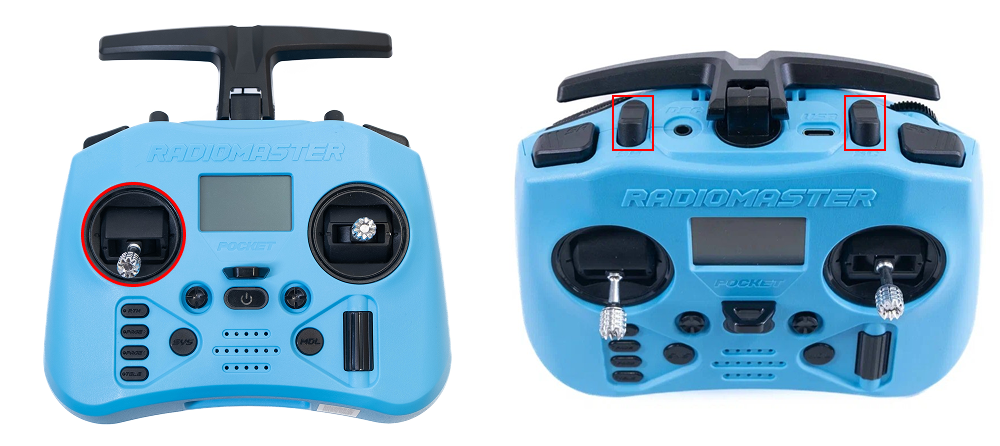

* Включите аппаратуру управления зажатием **кнопки питания** до появления на экране 4-х точек

    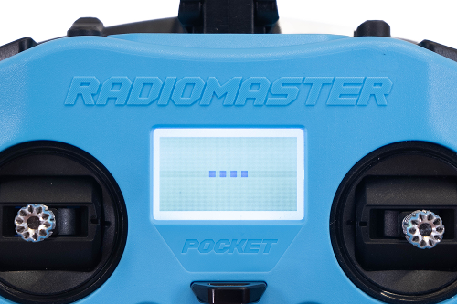

> **Hint** Если при включении на экране аппаратуры управления сообщение с предупреждением, перепроверьте положение стиков и тумблеров

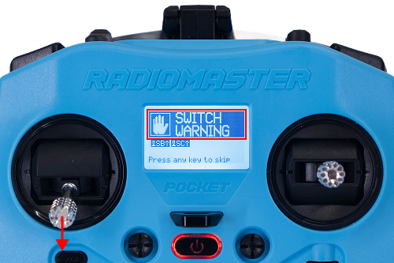

* Перед началом работы подключите к аппаратуре управления зарядное устройство через порт USB Type‑C и оставьте подключённым постоянно (можно использовать во время полётов)

* Подключите аппаратуру управления к компьютеру через верхний разъём USB-C (находится на верхней грани аппаратуры управления) с помощью USB-кабеля

    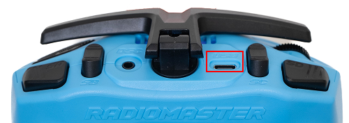

* В появившемся окне на экране аппаратуры управления выберите **USB Storage (SD)**

    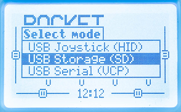

* Откройте на компьютере папку со скачанным [архивом](https://www.google.com/url?q=https://drive.google.com/drive/folders/13V-xxbfMj9bZtWU3VrE0vCBnuwDvGQ82?usp%3Ddrive_link&sa=D&source=docs&ust=1773057066587064&usg=AOvVaw2IXGQhfwC7kRUnIrMfr3Ho) готовых настроек аппаратуры управления, архив содержит следующие файлы:

<table class="type_table">
  <tr>
    <td>model00.yml</td>
    <td>Профиль настроек для управления Обриком</td>
  </tr>
  <tr>
    <td>radio.yml</td>
    <td>Настройки передатчика (аппаратуры управления)
</td>
  </tr>
   <tr>
    <td>ru</td>
    <td>Архив русской озвучки</td>
  </tr>
</table>

* Откройте хранилище аппаратуры управления, в папку **MODELS** скопируйте файл *model00.yml*

> **Caution** Если в этих папках уже есть файлы с такими названиями, удалите их или согласитесь на замену при копировании

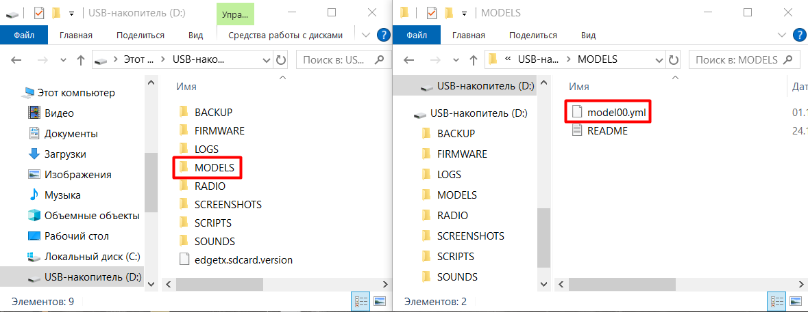

* В папку **RADIO** скопируйте файл *radio.yml*

> **Caution** Если в этих папках уже есть файлы с такими названиями, удалите их или согласитесь на замену при копировании

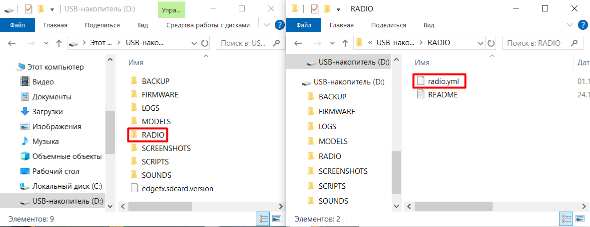

* В папку **SOUNDS** скопируйте папку *ru*

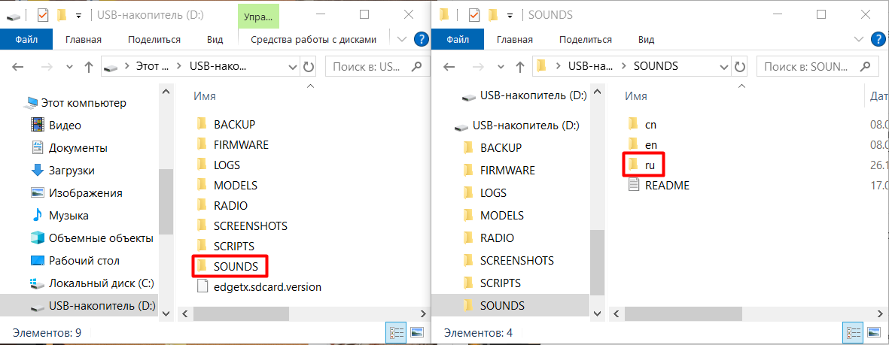

* Отключите аппаратуру управления от компьютера

Для применения русской озвучки:

* Нажмите кнопки **SYS**

    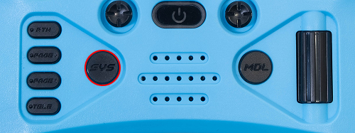

* С помощью кнопки **PAGE>** перейдите в третью (3/7) вкладку **RADIO SETUP**

    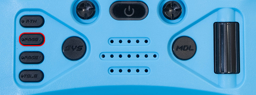

* Пролистайте до **voice language** и выберите **Russian**

### Индикация приемника

<table class="type_table">
    <tr>
        <td></td>
        <td>Непрерывный свет</td>
        <td>Подключен к передатчику или включен режим загрузчика</td>
    </tr>
    <tr>
        <td></td>
        <td>Медленное мигание (500 мс вкл/выкл)</td>
        <td>Ожидание соединения с передатчиком</td>
    </tr>
    <tr>
        <td></td>
        <td>Быстрое мигание (25 мс вкл/выкл)</td>
        <td>Режим раздачи Wi-Fi включен</td>
    </tr>
</table>

## Шаг 2. Сопряжение аппаратуры управления и Обрика (Bind) через Binding Phrase

### Настройка передатчика (TX)

* Включите аппаратуру управления
* Нажмите кнопку **SYS**

    

* Перейдите в меню **ExpressLRS**

    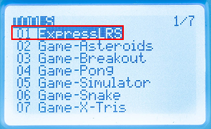

> **Caution** Чтобы выйти из меню ExpressLRS, нужно зажать кнопку **RTN**

* Выберете пункт **Wifi Connectivity**

    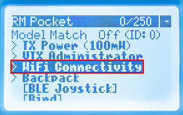

* Выберете пункт **Enable Wifi**

    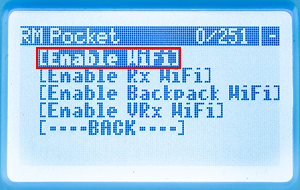

* Подключитесь к сети Wi-Fi  ExpressLRS TX на своем устройстве (телефон, ноутбук, ПК) с паролем expresslrs

    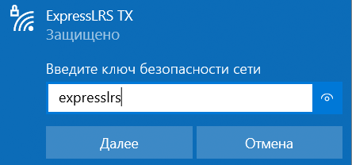

* Перейдите на адрес `10.0.0.1` в браузере

    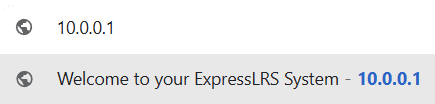
    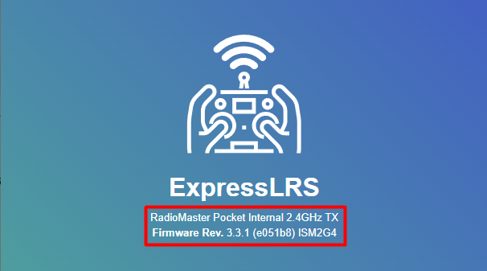

> **Note** Из шапки страницы можно узнать название нашего передатчика TX (первая строка) и версию прошивки (вторая строка). Если прошивка передатчика ТХ ниже чем [3.3.1](https://drive.google.com/file/d/1OUVBTHfTgQ36D4WrX5AeVcz1UwrWtQMS/view?usp=drive_link), то нам нужно прошить его на [более новую версию](https://expresslrs.github.io/web-flasher/).

* В поле **Binding Phrase** введите уникальное слово и нажмите **SAVE** для сохранения параметров

    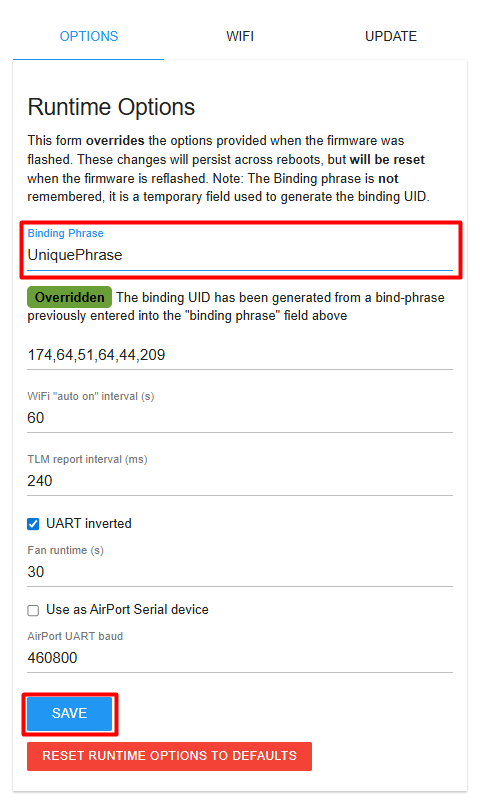

> **Note** По этому слову приемник будет находить передатчик. Вводите действительно уникальную фразу во избежание перекрестных подключений. Никаких дополнительных процедур для бинда не требуется, все автоматически

* В открывшемся окне нажмите **REBOOT** для перезагрузки передатчика

    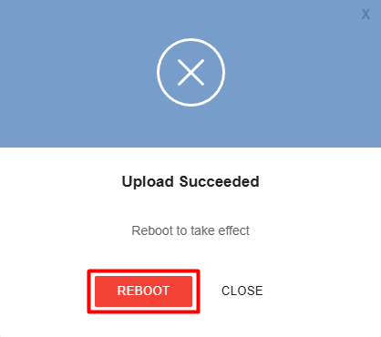

### Настройка приемника (RX)

* Включите Обрик

> **Caution** Если включаете Обрик с помощью АКБ убедитесь, что воздушные винты сняты

* Подождите 60 секунд (после этого приемник перейдет в режим раздачи Wi-Fi)
* Подключитесь к сети Wi-Fi ExpressLRS RX на своем устройстве (телефон, ноутбук, ПК) с паролем expresslrs

    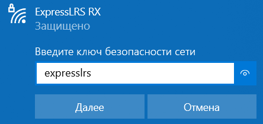

* Перейдите на адрес `10.0.0.1` в браузере

    
    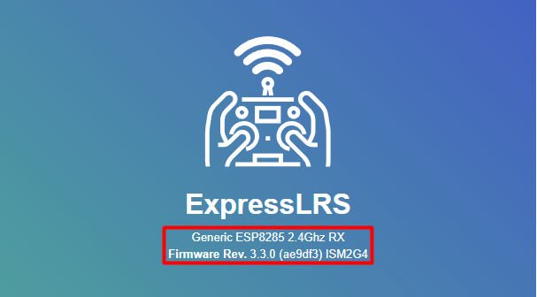

> **Note** Из шапки страницы можно узнать название нашего передатчика TX (первая строка) и версию прошивки (вторая строка). Если прошивка передатчика ТХ ниже чем [3.3.1](https://drive.google.com/file/d/1OUVBTHfTgQ36D4WrX5AeVcz1UwrWtQMS/view?usp=drive_link), то нам нужно прошить его на [более новую версию](https://expresslrs.github.io/web-flasher/).

* В поле **Binding Phrase** введите <u>**ТАКОЕ ЖЕ**</u> уникальное слово, как и в передатчике, и нажмите **SAVE** для сохранения параметров

    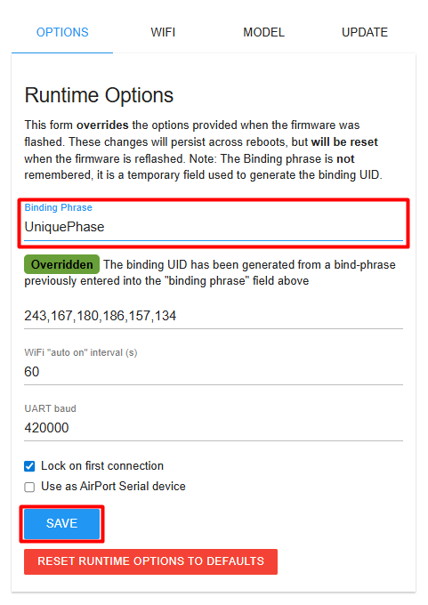

> **Note** По этому слову приемник будет находить передатчик

* В открывшемся окне нажмите **REBOOT** для перезагрузки передатчика

    

* После успешного сопряжения аппаратура управления коротко вибрирует, а светодиод на приемнике перестанет мигать и будет гореть постоянно
* Проверить сопряжение можно на главном экране аппаратуры управления наличием индикации связи и по звуковому оповещению

> **Hint** Если связи нет, вернитесь к настройкам и проверьте, что **Binding Phrase** на передатчике (TX) и приёмнике (RX) совпадает полностью

  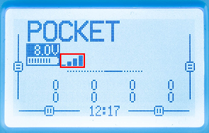

> **Caution** Если связь есть, но Обрик не воспринимает команды с аппаратуры управления, то в меню **ExpressLRS** измените параметр **Model Match** с положения **off** в положение **on** и снова в положение **off**
