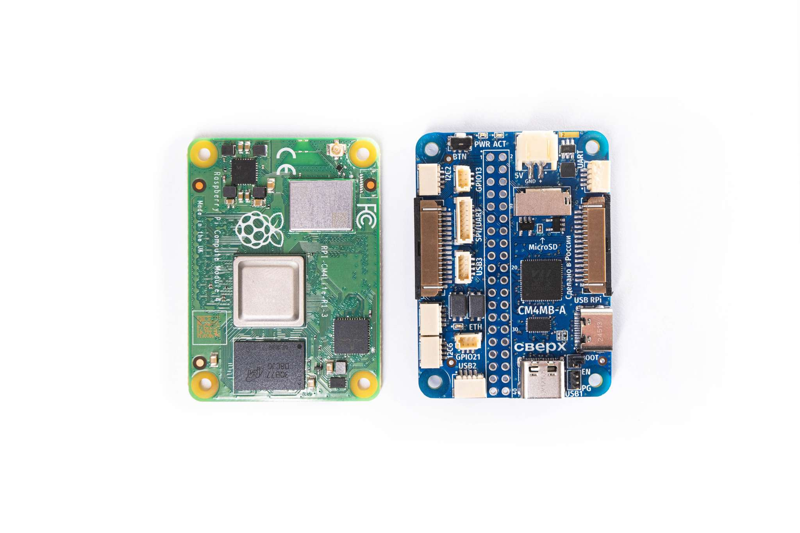

# Бортовой компьютер

Бортовой компьютер платформы Обрик состоит из **Raspberry Pi Compute Module 5 (CM5) и платы ввода-вывода собственной разработки**.

Плата ввода-вывода оптимизирована для Обрика: **габариты не превышают модуль** (55 × 40 мм, ~20 г), обеспечивая минимальную массу и широкую функциональность автономных систем.

Обеспечивает интерфейсы:

* USB 3.1 (5 Гбит/с, Type‑C) — лидары, камеры
* Ethernet (100 Мбит/с) — стабильная связь  
* 2× MIPI CSI (2-lane) — стереозрение
* 2× USB 2.0 + 40-pin GPIO (JST‑SH разъёмы)

В квадрокоптере бортовой компьютер подключается к полетному контроллеру и используется как вспомогательный компьютер. Он позволяет [подключаться к дрону по Wi-Fi](connect_wi-fi.md), программировать автономные полеты, работать с периферией и многое другое.
