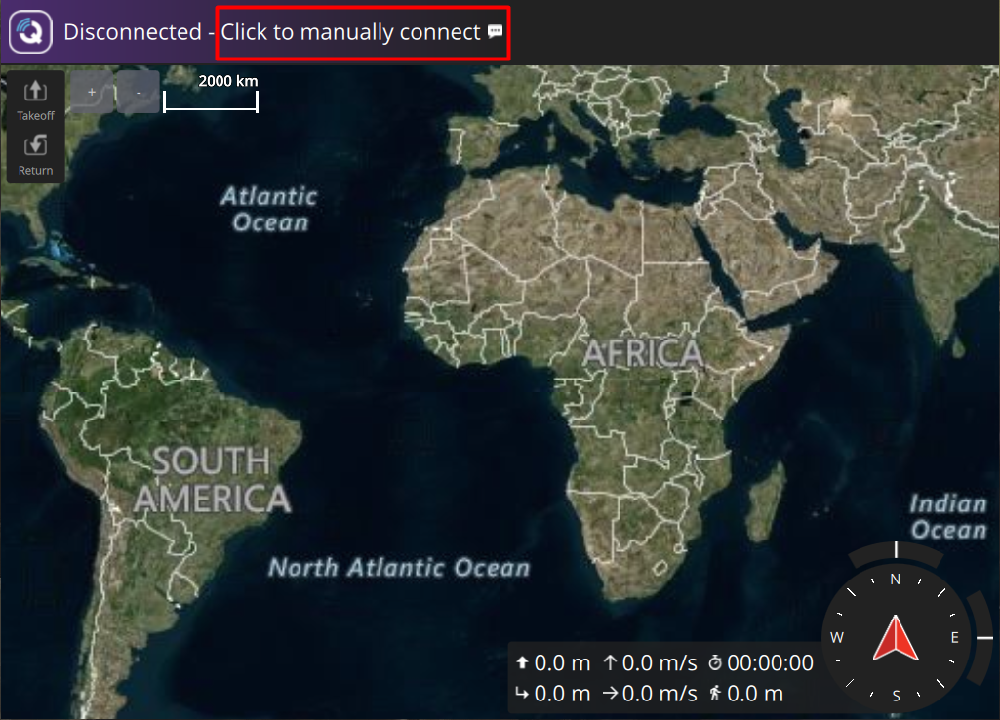
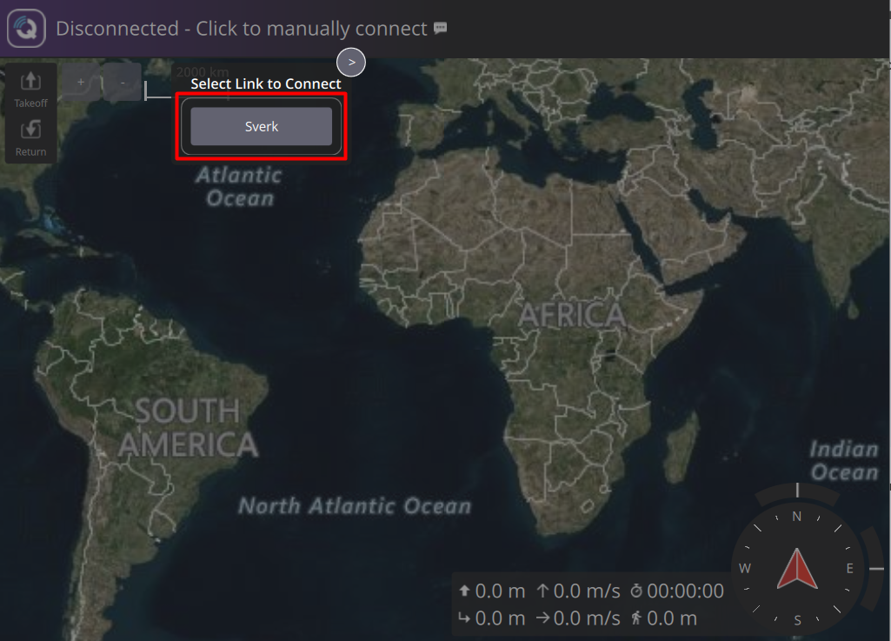
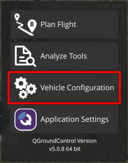
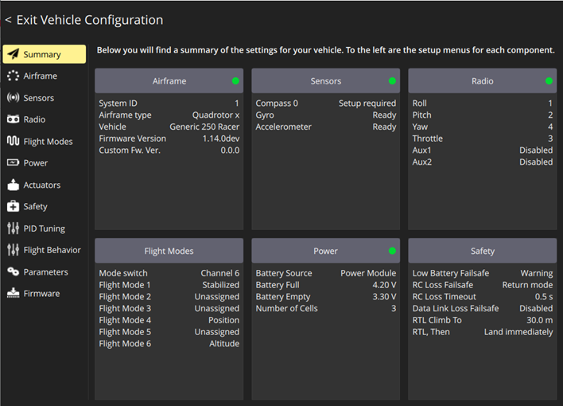

# Настройка полетного контроллера

Если во время проведения настройки полетного контроллера ваш компьютер будет подключен к Wi-Fi сети бортового компьютера, а не к общей точке доступа, то у вас не будет доступа к сети интернет, убедитесь, что скачали программу QGroundControl (QGC) и файл с параметрами полетного контроллера.

<!-- * Включите аппаратуру управления
* **Убедитесь, что воздушные винты сняты**
* Включите Обрик используя АБК либо кабель USB Type-C
* Убедитесь, что Обрик подключен к аппаратуре управления (на экране аппаратуры появилась индикация связи с Обриком)
* Запустите программу QGC
* Подключитесь к Обрику по Wi-Fi, на главном экране QGC  нажмите на **Click to manually connect**

     -->

* Убедитесь, что вставлена SD карта
* Убедитесь, что Обрик подключен по Wi-Fi

    

* Нажмите на **логотип QGC** в левом верхнем углу

    

* Выберите **Vehicle Configuration**

    

Вкладка **Summary** содержит информацию о выбранных настройках и состоянии систем (зеленый маркер - система настроена, красный маркер - не настроена)

