<!-- markdownlint-disable MD044 -->
# Работа с полем ArUco-маркеровнавигации для Обрик ROS2

В комплектации идёт готовая распечатанная карта меток, которая записана в систему бортового компьютера при установке образа.

> **Info** Помните, что точность навигации напрямую зависит от качества калибровки камеры, освещенности и физического состояния меток. Регулярно проверяйте систему и при необходимости повторяйте калибровку.

## Основная структура образа

<!--<pre>
.
├── docker-compose.yml                # Главный файл для запуска Docker-контейнеров (определяет сервисы, volumes, сеть)
├── docs                               # Основная документация проекта и руководства
│   ├── README.md                     # Первая вкладка документации / введение
│   └── SUMMARY.md                    # Структура документации (оглавление)
├── dotmdVisualiser                   # Инструмент визуализации упрощённого интерфейса (веб-дашборд)
│   ├── main_page.json                # Конфигурация страницы в упрощённом интерфейсе
├── README.md                          # Файл, который вы сейчас читаете (общее описание репозитория)
├── sverk-ros2-ui                      # Веб-оболочка для управления дроном (графический интерфейс)
├── sverk_ws                           # Рабочее пространство ROS2 (на хосте, монтируется в контейнер)
│   └── src
│       └── sverk_drone                # Основной мета-пакет проекта
│           ├── airframes               # Конфигурации различных типов дронов (рамы, параметры)
│           ├── main_package            # Центральный пакет для запуска всей системы
│           │   ├── launch_system       # Командный пункт: скрипты запуска
│           │   │   ├── launch
│           │   │   │   ├── full_system_real.launch.py       # Запуск всей системы на реальном дроне
│           │   │   │   ├── full_system_sitl_cam.launch.py   # Запуск в симуляторе с обычной камерой
│           │   │   │   ├── full_system_sitl_depth.launch.py # Запуск в симуляторе с камерой глубины
│           │   │   │   └── full_system_sitl_lidar.launch.py # Запуск в симуляторе с лидаром
│           │   └── self_check           # Пакет для автоматической проверки работоспособности всех компонентов
│           ├── odometry                 # Модули для оценки положения и карты
│           │   ├── aruco                 # Работа с Aruco-метками
│           │   │   ├── aruco_det_loc      # Детекция меток и локализация по ним
│           │   │   │   ├── launch
│           │   │   │   │   ├── aruco_detect.launch.py   # Запуск детектора Aruco-меток
│           │   │   │   │   └── aruco_loc.launch.py      # Вычисление позиции дрона относительно карты меток
│           │   │   │   └── README.md                     # Пояснения по использованию детекции
│           │   │   └── aruco_map          # Публикация карты Aruco-меток
│           │   │       ├── config
│           │   │       │   └── markers.txt               # Файл с координатами меток (пример карты)
│           │   │       ├── launch
│           │   │       │   └── aruco_map.launch.py       # Публикация карты меток в ROS-топики
│           │   │       └── README.md                      # Описание работы с картой меток
│           │   └── vpe                    # Визуальная одометрия (Visual Pose Estimation)
│           │       ├── px4_local_pose_publisher           # Публикация локальной позиции от PX4 в ROS
│           │       │   ├── include
│           │       │   │   └── px4_local_pose_publisher
│           │       │   │       └── pose_subscriber_tf2.hpp  # Заголовочный файл для подписчика на позицию
│           │       │   ├── launch
│           │       │   │   └── pose_subscriber_tf2.launch.py # Запуск узла для публикации tf2 из позиции PX4
│           │       │   └── src
│           │       │       └── pose_subscriber_tf2.cpp       # Реализация подписчика на позицию PX4
│           │       └── px4-ros2-interface-lib                # Библиотека для отправки одометрии и команд в PX4
│           ├── offboard                   # Режимы внешнего пилотирования (offboard control)
│           │   ├── fmu_calibration_control # Пакет для отправки команд на полётный контроллер
│           │   ├── offboard_control        # Основной пакет для управления дроном из ROS (offboard)
│           │   │   ├── examples            # Примеры скриптов на Python для offboard-полётов
│           │   │   │   ├── test_all_services.py   # Тестирование всех доступных сервисов для пилотирования
│           │   │   │   └── test_fly_cube.py       # Пример полёта по кубу
│           │   │   └── Readme.md            # Пояснения по использованию offboard-управления
│           │   └── offboard_interfaces      # Пользовательские сообщения для offboard-режима
│           ├── peripheral                   # Драйверы и интерфейсы периферийных устройств
│           │   ├── camera_driver             # Калибровка и настройка камеры
│           │   ├── camera_ros                # ROS-пакет для получения изображений с камеры
│           │   │   ├── config                # Параметры камеры для разных разрешений
│           │   │   │   ├── ov5647_1920x1080.yaml   # Параметры для сенсора OV5647 (Full HD)
│           │   │   │   ├── ov5647_320x240.yaml     # Параметры для OV5647 (320x240)
│           │   │   │   ├── ov5647_640x480.yaml     # Параметры для OV5647 (640x480)
│           │   │   │   └── params.yaml             # Общие параметры камеры
│           │   │   └── launch
│           │   │       └── camera.launch.py        # Запуск узла камеры с выбранными параметрами
│           │   ├── led                        # Управление светодиодной индикацией
│           │   │   ├── led_interfaces          # Сообщения и сервисы для управления светодиодами
│           │   │   └── Readme.md               # Описание протокола индикации
│           │   └── vl53l1x_rangefinder         # Драйвер дальномера VL53L1X (ToF)
│           ├── px4                           # Интеграция с автопилотом PX4
│           │   ├── Micro-XRCE-DDS-Agent       # Агент для связи PX4 с ROS2 через DDS (подмодуль)
│           │   ├── px4_msgs                    # Сообщения ROS2 для PX4 (подмодуль)
│           │   └── px4_ros_com                 # Мост между ROS2 и PX4 (подмодуль)
│           └── web                            # Веб-интерфейсы и связанные компоненты
└── scripts                                      # Скрипты для установки и запуска зависимостей
    ├── Dockerfile                            # Инструкция для сборки Docker-образа (базовое окружение ROS2 + uXRCE-DDS + MAVLink Router)
    └── install-code-server.sh                  # Скрипт установки code-server в контейнере
</pre>-->

## Подключение

* Убедитесь, что воздушные винты сняты
* Включите Обрик, используя АКБ либо кабель USB Type-C
* Подключитесь к сети Wi-Fi Обрика (к точке доступа Обрика или к роутеру, к которому он подключён)
* Откройте браузер и введите в адресной строке введите IP-адрес вашего Обрика <!--http://192.168.11.1 (адрес по умолчанию) или другой, указанный в вашей сети

После подключения доступен Веб-интерфейс с основными веб-инструментами:

* Документация
* Список топиков для работы с камерой
* Visual Studio Code
* Онлайн терминал
* Работа камеры
* 3D визуализация
* Логи Обрика

## Вход в систему через Web Terminal

* В веб-интерфейсе найдите и откройте раздел **Web Terminal**

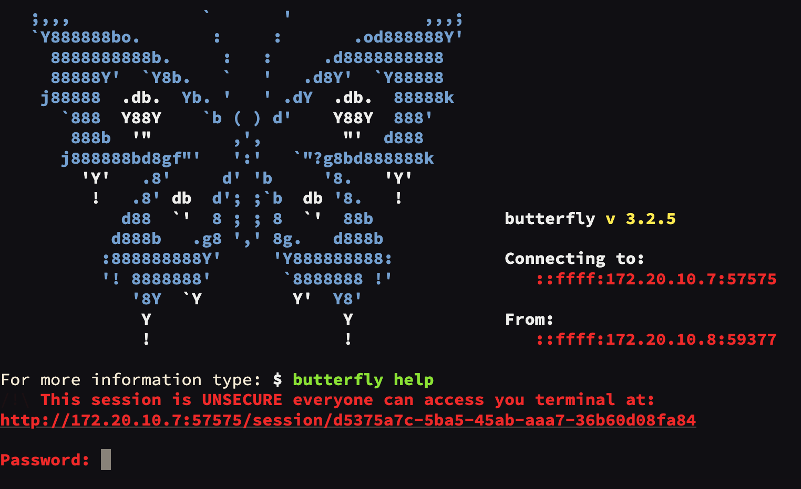

* В открывшемся терминале введите пароль: `raspberry`

> **Caution** Символы пароля не отображаются при вводе в целях безопасности

* После успешного ввода вы увидите командную строку:

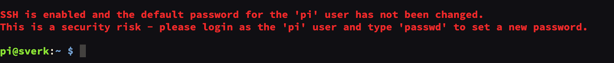

> **Hint** [Ознакомьтесь с основными командами для работы с терминалом](.md)

## Команды генерации файла карты ArUco-маркеров бортового компьютера

> **Tips** Подробности описаны в статье [«Навигация по картам ArUco-маркеров»](aruco_map_ros2.md)

Для создания файла карты необходимо выполнить команду с заданными параметрами.

Определите следующие значения для вашей карты:

* LENGTH — размер маркера (в метрах)
* X — количество маркеров по оси X
* Y — количество маркеров по оси Y
* DIST_X — расстояние между центрами маркеров по оси X (в метрах)
* DIST_Y — расстояние между центрами маркеров по оси Y (в метрах)
* FIRST_ID — ID первого (левого нижнего) маркера
* --bottom-left (опционально) — начинать нумерацию маркеров с левого нижнего угла
* MAP_NAME — имя файла карты (например, new_map.txt).

### Выполните команду генерации

* В терминале выполните следующую команду, подставив свои параметры:

  ```bash
  ros2 run aruco_pose genmap.py LENGTH X Y DIST_X DIST_Y FIRST_ID [--bottom-left] [-o MAP_NAME]
  ```

  <!-- **Пример:** `ros2run aruco_pose genmap.py 0.3 3 2 0.5 0.5 0 > ~/sverk_ws/src/sverk_drone/odomerty/aruco/aruco_map/config/sverk.txt --top-left` -->

### Пример генерации карты ArUco-меток

На изображении ниже показана физическая карта ArUco-меток


<!--  -->

Параметры для генерации ArUco-меток обозначены под каждой из них:

* LENGTH - 0.3 - длина стороны маркера (м)
* X - 3 - количество маркеров по оси X (столбцов)
* Y - 2 - количество маркеров по оси Y (строк)
* DIST_X - 0.5 - расстояние между центрами маркеров по оси X (м)
* DIST_Y - 0.5 - расстояние между центрами маркеров по оси Y (м)
* FIRST_ID - 42 - ID первого маркера
* --top-left (опционально) — начинать нумерацию маркеров с левого dверхнего угла
* MAP_NAME — имя файла карты (например, sverk.txt)

Назовем файл sverk.txt

Из вышеуказанных данных собираем команду:

```bash
ros2 run aruco_pose genmap.py 0.3 3 2 0.5 0.5 42 --top-left -o sverk.txt
```

> **Hint** Поскольку в качестве первой метки мы указали метку №42 теперь наша карта сгенерируется, имея метки по порядку возрастания начиная с №42: 43, 44, 45, 46, 47, 48. Однако, у нас номера иные. Необходимо отредактировать ранее созданный файл.

### Редактирование карты ArUco-меток

* Откройте файл с помощью команды:

  ```bash
  nano ~/sverk_ws/src/sverk_drone/odomerty/aruco/aruco_map/config/sverk.txt
  ```

* Внесите изменения

  Поменяем первый столбец исходя из наших номеров меток и размер первой метки для взлета:

  > **Hint** Для замены значения перемещайтесь внутри файла спомощью стрелок

  Было:

  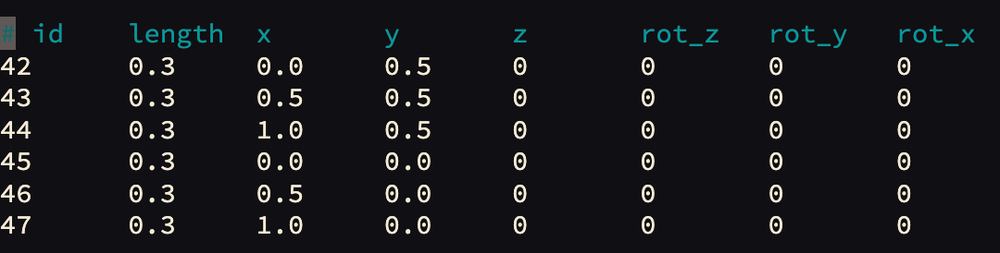

  Стало:

  

* Сохраните и выйдите: `Ctrl`+`X`, `Y`, `Enter`.

* Для применения изменений перезагрузите сервис Обрика:

  ```bash
  sudo systemctl restart sverk.service
  ```

  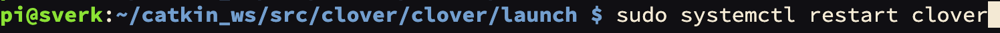

Проверьте вид сгенерированной карты ArUco-меток:

* Откройте веб-интерфейс
* В веб-интерфейсе перейдите в раздел **View image topics (web_video_server)**
* Откройте топик **/aruco_map/image**
* Убедитесь, что карта ArUco-меток корректно сгенерировалась - в соответствии с изначальным примером

  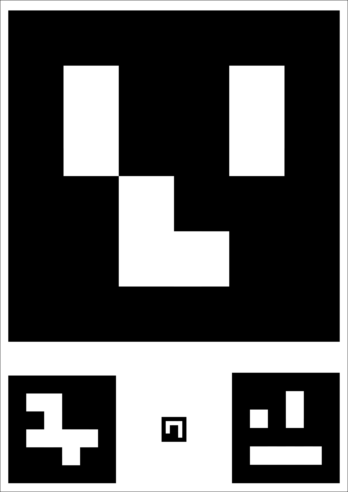

### Проверка навигации

После запуска системы проверьте, что ArUco-навигация работает:

```bash
ros2 topic echo /aruco_map/pose
```

Если дрон видит маркеры, вы увидите поток сообщений с координатами.

## Параметры ноды offboard_control

| Параметр | Значение по умолчанию | Описание |
|----------|-----------------------|----------|
| `navigate_frame_id` | `map` | Система координат по умолчанию |
| `default_speed` | `0.5 м/с` | Скорость полёта по умолчанию |
| `offboard_timeout` | `10.0 с` | Таймаут перехода в OFFBOARD |
| `simulator` | `false` | Режим SITL-симуляции |
| `check_kill_switch` | `true` | Проверка Kill Switch |

## Веб-интерфейсы

Дрон предоставляет два веб-интерфейса:

1. **dotmdVisualiser** — визуализация данных, телеметрия.
2. **sverk-ros2-ui** — управление, просмотр видео, статус системы.

Оба доступны через браузер по IP-адресу вашего Обрика.


<!-- ## Генерация карты ArUco-меток для печати

Установите генератор карт ArUco-меток:

* iOS
* Windows<br>
  Запустите приложение на компьютере

  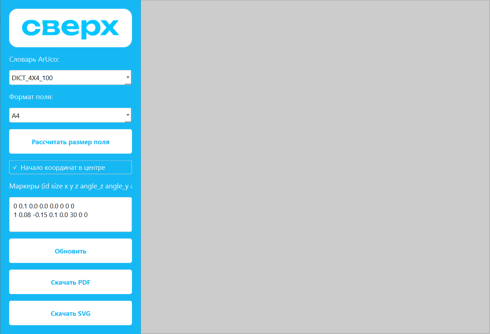

* Во вкладке **Словарь ArUco** выберите необходимый тип меток. Для Обрика используется словарь **DIST_4X4_100**

  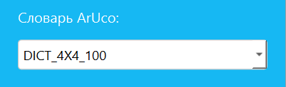

* Откройте файл с конфигурацией карты ArUco-меток на бортовом компьютере, используя команду:

  ```bash
  nano ~/catkin_ws/src/sverk/aruco_pose/map/ВАШ_ФАЙЛ.txt
  ```

  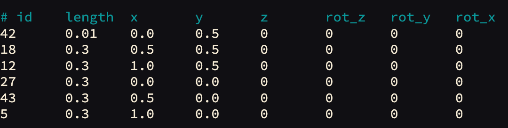

> **Caution** Не забудьте заменить ВАШ_ФАЙЛ.txt на актуальное название файла

* Скопируйте всё текстовое содержимое открытого файла и вставьте его в программу для генерации карты

  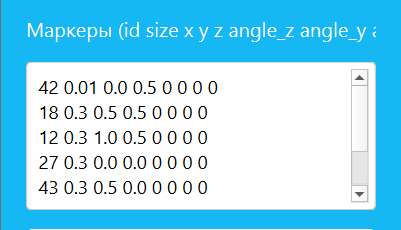

* Нажмите **Рассчитать размер поля** для автоматической настройки

  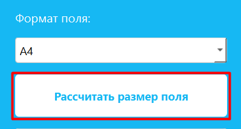

> **Note** Для печати больших полей рекомендуется задать произвольный размер. Для этого выберите пункт **Custom** и укажите параметры в миллиметрах.

* Нажмите кнопку **Обновить**. Проверьте правильность карты и, если всё верно, нажмите **Скачать в PDF** и **Скачать SVG**

  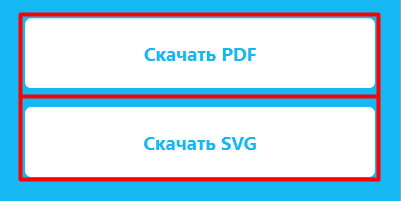

* Распечатайте карту ArUco-меток и разместите её в полетной зоне

> **Note** После расчета размера поля, формат поля измениться на Custom

## ⚠️ Важное требование к печати

Печать обязательно должна быть **матовой**. Если метки будут бликовать, камера Обрика не сможет их распознать, и автономный полет будет невозможен.

### Пример сгенерированной карты ArUco-меток

Используйте карту, созданную в предыдущем примере

<table class="type_table">
  <tr>
    <td># id</td>
    <td>length</td>
    <td>x</td>
    <td>y</td>
    <td>z</td>
    <td>rot_z</td>
    <td>rot_y</td>
    <td>rot_x</td>
  </tr>
  <tr>
    <td>42</td>
    <td>0.01</td>
    <td>0.0</td>
    <td>0.5</td>
    <td>0</td>
    <td>0</td>
    <td>0</td>
    <td>0</td>
  </tr>
  <tr>
    <td>18</td>
    <td>0.3</td>
    <td>0.5</td>
    <td>0.5</td>
    <td>0</td>
    <td>0</td>
    <td>0</td>
    <td>0</td>
  </tr>
  <tr>
    <td>12</td>
    <td>0.3</td>
    <td>1.0</td>
    <td>0.5</td>
    <td>0</td>
    <td>0</td>
    <td>0</td>
    <td>0</td>
  </tr>
  <tr>
    <td>27</td>
    <td>0.3</td>
    <td>0.0</td>
    <td>0.0</td>
    <td>0</td>
    <td>0</td>
    <td>0</td>
    <td>0</td>
  </tr>
    <tr>
    <td>43</td>
    <td>0.3</td>
    <td>0.5</td>
    <td>0.0</td>
    <td>0</td>
    <td>0</td>
    <td>0</td>
    <td>0</td>
  </tr>
  <tr>
    <td>5</td>
    <td>0.3</td>
    <td>1.0</td>
    <td>0.0</td>
    <td>0</td>
    <td>0</td>
    <td>0</td>
    <td>0</td>
  </tr>
</table>

* Скачиваем в PDF или SVG. Откройте в любом PDF, SVG редакторе

> **Caution** После печати поля проверьте размеры ArUco-меток

`В веб-интерфейсе перейдите в раздел web_video_server
Откройте топик /aruco_map/image
Наведите камеру Обрика на метку. Убедитесь, что они корректно определяются, а их ID отображаются поверх изображения` -->
<!-- markdownlint-disable MD044 -->
