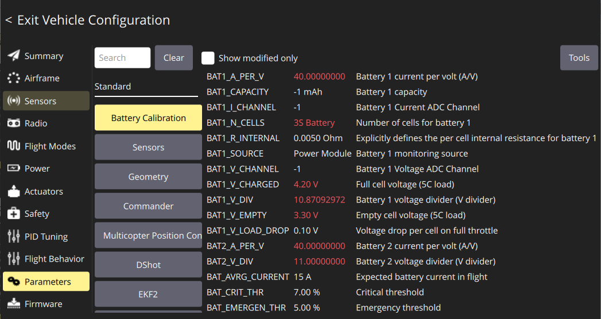
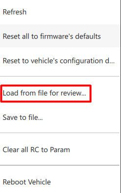
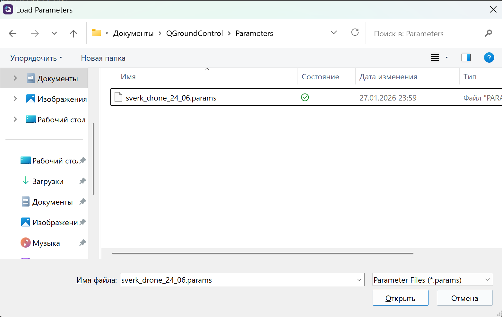
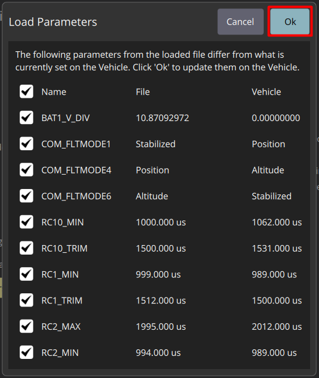
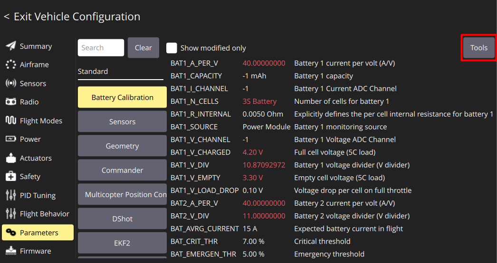
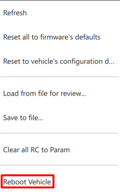
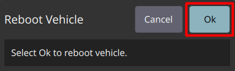

# Загрузка параметров

Во вкладке **Parameters** находятся все настройки полётного контроллера, но без графического интерфейса.

*Загрузите базовый [файл](https://drive.google.com/file/d/1392MPugvBD1SA4eytPBsy4nv05whPwLh/view?usp=drive_link) параметров, который содержит большую часть настроек. Однако некоторые параметры (такие как калибровка датчиков, аппаратуры управления и питания) требуют ручной настройки, так как зависят от физического состояния датчиков IMU и аппаратуры управления и могут меняться.*

* Загрузите параметры из [файла](https://drive.google.com/file/d/1392MPugvBD1SA4eytPBsy4nv05whPwLh/view?usp=drive_link)
* Нажмите кнопку **Tools**

    

* В открывшемся окне выберите **Load from file for review**

    

* Выберете скаченный файл с параметрами полетного контроллера

    

* В открывшемся файле вы можете изучить заменяемые параметры из файла и нажмите **Ok**

  

* Перезагрузите Обрик
* Нажмите кнопку **Tools**

    
    

* Нажмите **Ok**

    
