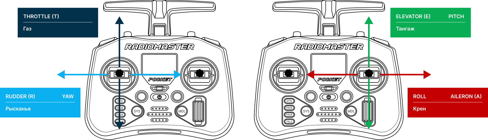
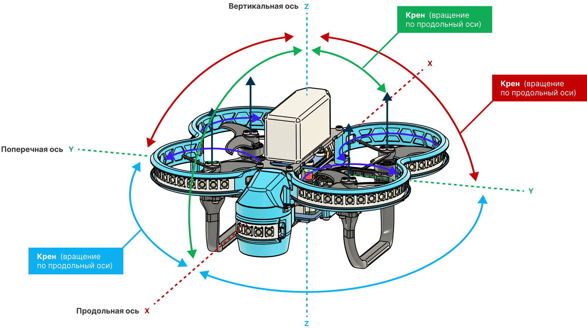
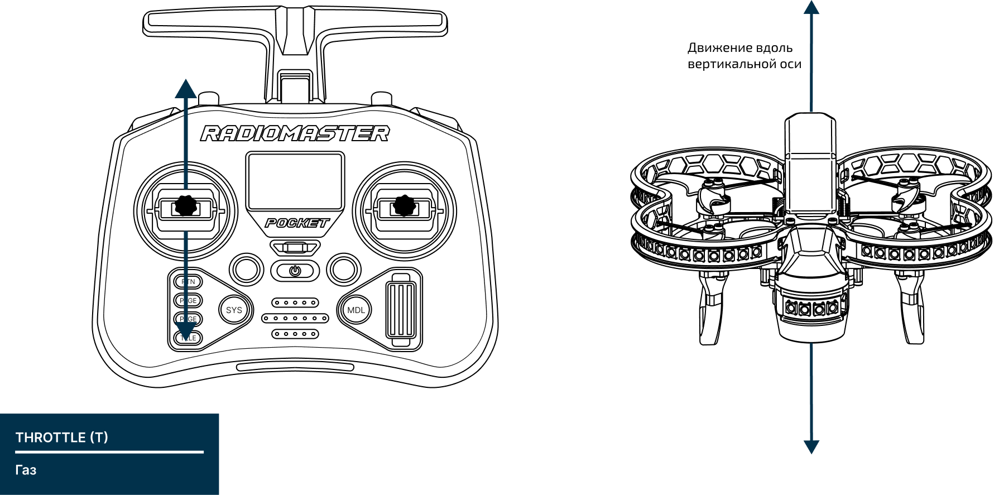
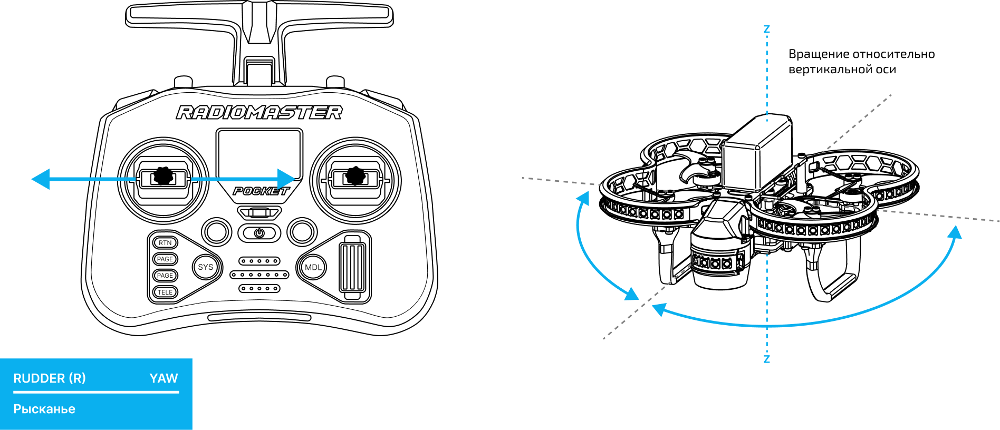
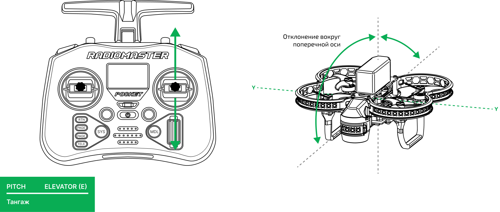
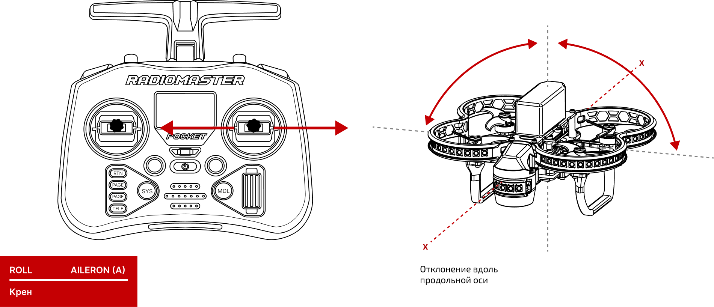

# Основы ручного пилотирования

Управление Обрик происходит с помощью двух стиков аппаратуры управления. По умолчанию **левый стик** отвечает за газ и рысканье, а **правый стик** за крен и тангаж. Данные термины используются для всех летательных аппаратов, от самолетов до квадрокоптеров.

**Газ (throttle)** – отвечает за скорость вращения двигателей

**Рысканье (yaw)** – отвечает за повороты вокруг вертикальной оси (Z), смещение стика вправо (влево) приводит к вращению по (против) часовой стрелки

**Тангаж (pitch)** – отвечает за наклон или движение вперёд/назад

**Крен (roll)** – отвечает за наклон или движение влево/вправо

> **Tips** Все описанные действий Обрика подразумеваются относительно его ориентации

## Визуальный полет (ручное управление)

При визуальном пилотировании оператор управляет Обриком напрямую.

**Режимы полета:**

> **Note** Действия стиков **Yaw, Pitch и Roll**  в полетных режимах не отличаются и отвечают за поворот, наклон вперед-назад и влево-вправо (полет).

* **STABILIZED** — стабилизация горизонтального положения, необходимо **ручное поддержание высоты**; 
  **Throttle** - управление газом происходит из нижнего положения стика; 
  При возврате правого стика в центральное положение **Обрика выровняется**, но продолжит движение по инерции и под воздействием внешних сил.

* **ALTITUDE** — удержание высоты; 
  **Throttle** - управление газом происходит из центрального положения стика и отвечает; **за скорость подъема/спуска** 
  При возврате обоих стиков в центральное положение **Обрика выровняется и будет удерживать текущую высоту**, но продолжит движение по инерции и под воздействием внешних сил.

* **POSITION** — полное удержание положения в пространстве и компенсации воздействия внешних сил; 
  **Throttle** - управление газом происходит из центрального положения стика и отвечает за **скорость подъема/спуска**; 
  При возврате обоих стиков в центральное положение **Обрика будет зафиксирован в позиции в пространстве, компенсируя ветер и другие силы**.
